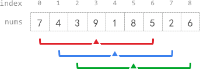

# Problem
https://leetcode.com/problems/k-radius-subarray-averages/description/

You are given a 0-indexed array nums of n integers, and an integer k.

The k-radius average for a subarray of nums centered at some index i with the radius k is the average of all elements in nums between the indices i - k and i + k (inclusive). If there are less than k elements before or after the index i, then the k-radius average is -1.

Build and return an array avgs of length n where avgs[i] is the k-radius average for the subarray centered at index i.

The average of x elements is the sum of the x elements divided by x, using integer division. The integer division truncates toward zero, which means losing its fractional part.

    For example, the average of four elements 2, 3, 1, and 5 is (2 + 3 + 1 + 5) / 4 = 11 / 4 = 2.75, which truncates to 2.

### Example 1:


    
    Input: nums = [7,4,3,9,1,8,5,2,6], k = 3
    Output: [-1,-1,-1,5,4,4,-1,-1,-1]
    Explanation:
    - avg[0], avg[1], and avg[2] are -1 because there are less than k elements before each index.
      - The sum of the subarray centered at index 3 with radius 3 is: 7 + 4 + 3 + 9 + 1 + 8 + 5 = 37.
        Using integer division, avg[3] = 37 / 7 = 5.
      - For the subarray centered at index 4, avg[4] = (4 + 3 + 9 + 1 + 8 + 5 + 2) / 7 = 4.
      - For the subarray centered at index 5, avg[5] = (3 + 9 + 1 + 8 + 5 + 2 + 6) / 7 = 4.
      - avg[6], avg[7], and avg[8] are -1 because there are less than k elements after each index.

### Example 2:

    Input: nums = [100000], k = 0
    Output: [100000]
    Explanation:
    - The sum of the subarray centered at index 0 with radius 0 is: 100000.
      avg[0] = 100000 / 1 = 100000.

### Example 3:

    Input: nums = [8], k = 100000
    Output: [-1]
    Explanation:
    - avg[0] is -1 because there are less than k elements before and after index 0.


### Constraints:

    n == nums.length
    1 <= n <= 105
    0 <= nums[i], k <= 105


# Solution
Use a sliding window that will contain all the elements starting at `i - k` upto `i + k`, calculate the total of the first window(when `i-k` is the 0-index) and then use arithmetic to update the total on each subsequent iteration, calculating the average on each new value of `i`.

Subsequent iterations only require to subtract the first element of the previous window from the `total`, and adding up the last element of the current one.

For illustration, take the first example -> `nums = [7,4,3,9,1,8,5,2,6], k = 3`

**Iteration 1**

    7 + 4 + 3 + 9 + 1 + 8 + 5 = 37

**Iteration 2**

Instead of looping from index `1` up to index `i + k` to add up all those elements, do:

    total - prevFirst + lastElement of new window
    37 - 7 + 2 = 32(newTotal)


## Main variables
- `i`: This index represents the current average we're trying to get. Is also the center of the radius
- `j`: We use this index only on the the first iteration to get the initial value of `total`.
- `total`: The result of adding up all the elements of the window. We'll update this value on each iteration.
- `windowSize`: The size of the window. We use this value to get the average from `total`.
- `windowStart`: Index that demarks the start of the window.
- `prevStart`: Holds the item of `nums` that was the start of the window of the previous iteration.
- `result`: The output array.

## Edge cases

- A radius(`k`) of 0 will yield the exact same input(`nums`) array, so we return `nums` inmediately on this case.

## Premises

- We should focus on the portion of the array for which `i - k ≥ 0 & i + k < n`. Any other index `i` that doesn’t satisfy these conditions can be filled up with `-1` by default. For that reason the `result` array is initialized with `-1` on all its positions. We will then modify the values of the indices that are within the pre-established range. 

## Algorithm

After initializing the `result` slice with `-1`, we calculate the initial value of `total` by adding up all the elements of the first window, the one that goes from `i - k` upto `i + k`(at this point this is the same as `windowSize`).

The loop goes from `k` to `len(nums)-k` because according to the problem statement, the values before `k` and after `len(nums)-k` should be `-1`.  
```go
for i := k; i < len(nums)-k; i++ {
    if i == k {
        for; j < windowSize; j++ {
            total += nums[j]
        }

        prevStart = nums[windowStart]
        windowStart++
        result[i] = total / windowSize
        continue
    }
    ...
```
---
Update the value of `total` by subtracting the first element of the previous window and adding up the last element of the new one. Also update the values of `prevStart` and `windowStart` to do the same on the next iteration.

Save the average on `result`.
```go
    total -= prevStart
    total += nums[i+k]
    prevStart = nums[windowStart]
    windowStart++
    result[i] = total / windowSize

```


