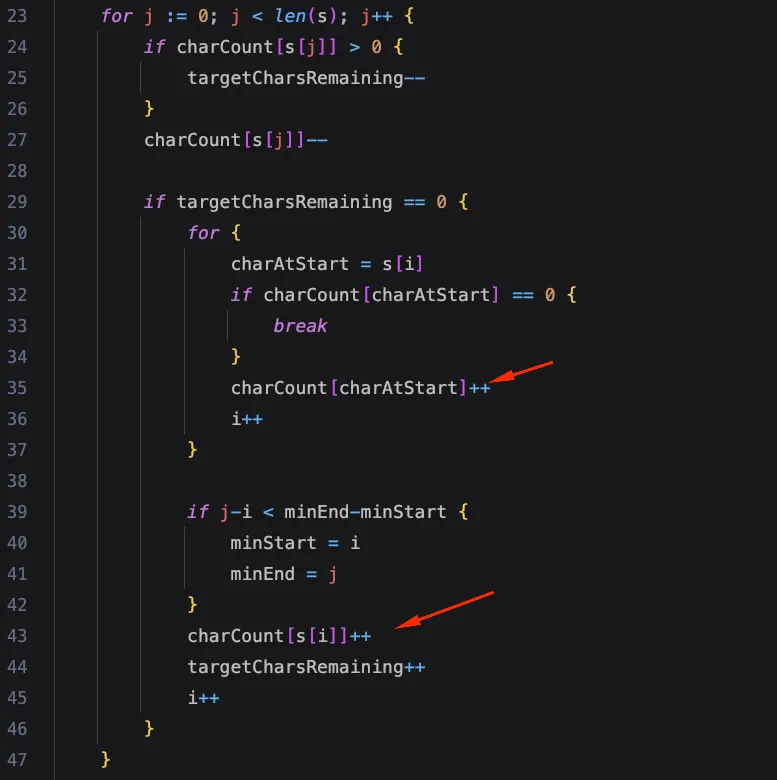

# Problem

https://leetcode.com/problems/minimum-window-substring

Given two strings `s` and `t` of lengths `m` and `n` respectively, return the minimum window *substring* of `s` such
that every character in `t` (including duplicates) is included in the window. If there is no such substring, return the
empty string "".

The testcases will be generated such that the answer is unique.

### Example 1:

    Input: s = "ADOBECODEBANC", t = "ABC"
    Output: "BANC"
    Explanation: The minimum window substring "BANC" includes 'A', 'B', and 'C' from string t.

### Example 2:

    Input: s = "a", t = "a"
    Output: "a"
    Explanation: The entire string s is the minimum window.

### Example 3:

    Input: s = "a", t = "aa"
    Output: ""
    Explanation: Both 'a's from t must be included in the window.
    Since the largest window of s only has one 'a', return empty string.

### Constraints:

    m == s.length
    n == t.length
    1 <= m, n <= 105
    s and t consist of uppercase and lowercase English letters.

# Solution

The solution is similar to the solution
of [Minimum Size Subarray Sum](https://leetcode.com/problems/minimum-size-subarray-sum/): a sliding window that expanded
until satisfying the condition, and then shrunk continuously to see if a smaller window could be obtained.

In a nutshell, the algorithm is comprised of 5 steps:

1. **Expansion**: we start with an empty window, and move the right pointer `j` to the right, character by character
   of `s` until we have a “valid” window.
2. **Validation**: as we move through `s` we keep track of the characters of `t` we have encountered. Once all the
   characters of `t` have been found, we will have a valid window.
3. **Contraction**: Upon finding a valid window, we try to reduce the window by moving the left pointer `i` as much as
   possible. We’ll stop moving `i` at the moment we realize that a further increment of `i` will result in an invalid
   window, i.e., a window that doesn’t have all the characters of `t`.
4. **Update minimum**: when we can’t contract the window no further, we update the minimum values that are the start and
   end indices of the minimum window.
5. **Repeat**: continue this process until the right pointer `j` reaches the last index of `s`, and we can’t contract
   the window any further.

### Initialization

```go
charCount := map[byte]int{}
targetCharsRemaining := len(t)
minStart := 0
minEnd := math.MaxInt32
var i int
var charAtStart byte
```

- `charCount`: indicates how many of each of the characters of `t` we’ll need to build the minimum substring. This map
  is initialized with the frequency of each character in `t`. Note that `charCount` isn’t the ultimate source of truth. Is
  not the thing that ultimately dictates when we have found a valid window, but instead *helps* us to know when that
  happens.

    ```go
    //Initializing charCount...
    for j := 0; j < len(t); j++ {
        charCount[t[j]]++
    }

    ```

  After we beging moving through `s`, the values of `charCount` will change to reflect a different reality. Let’s say
  that `c` is the current character of `s` we are examinating, so if…

    - `charCount[c] > 0`, we need more of character `c` to satisfy the requirements of `t`.
    - `charCount[c] == 0`, we have all the `c` character(s) we need to satisfy `t`.
    - `charCount[c] < 0`, means we have more characters of `c` than we need for `t`, so we have a surplus than can imply
      two things:
        - we have more characters `c` than those required by `t`
        - character `c` is not required at all in `t`.
- `targetCharsRemaining`: indicates how many more characters we have to look for in `s` in order to build a valid
  substring.
- `minStart`, `minEnd`: these are the pointers that delimit the minimum window that satisfies the condition. Every time
  we find a smaller window, these values will be updated to reflect it.
- `charAtStart`: utility variable that will help us identify the character at the beginning of the window. Used to improve readability. 
- `i`: the left pointer of the sliding window.

### Edge case handling
```go
if len(t) > len(s) {
    return ""
}
```

In this case we return an empty string inmediately because there is no possible way to have a substring of `s` that
includes all the elements of `t`, if `t` is larger than `s`.

### Window expansion
```go
for j := 0; j < len(s); j++ {
    if charCount[s[j]] > 0 {
        targetCharsRemaining--
    }
    charCount[s[j]]--
...
}
```
We use an outer loop to expand the window with `j`. If the new character `s[j]` is part of `t`, we
reduce `targetCharsRemaining`. The value of `charCount[s[j]]` will always be reduced whether that character is or not
on `t`, why? Characters with negative frequencies that **do form part of `t`** will be handled properly in the next
section of code. Hence, there is no need to complicate the code by adding conditionals for handling both cases of
negative frequencies.

### Window shrinking
```go
if targetCharsRemaining == 0 {
    for {
        charAtStart = s[i]
        if charCount[charAtStart] == 0 {
            break
        }
        charCount[charAtStart]++
        i++
    }
    //...
}
```
Now that all the characters of `t` are included in the current window(`targetCharsRemaining == 0`) we attempt to shrink
it as far as we can. The idea here is continuously shrinking the window by moving the left pointer to the right, until
we find a character without which we can form a valid window(indicated by `charCount[charAtStart] == 0`).

We then do `charCount[charAtStart]++` basically for the upkeeping of the algorithm. If the frequency of that character
is negative we increase it to say: “the surplus of this character is lower because we just excluded it from the window”;
if the frequency is positive, we increase it even more to say: “we excluded this character from the current window
because we need more of it to form a valid substring, so I’m updating the `charCount` so that you can know how much of
that character you’ll need in the future”.

Note that not all the characters we “reject” by shrinking the window are characters not required by `t`. The ones with
positive frequencies are in fact, required. That’s why we update `charCount`, so that in further iterations those
characters are taken into consideration.

### Minimum window update, upkeep & validation
```go
if targetCharsRemaining == 0 {
    //...
    if j-i < minEnd-minStart {
        minStart = i
        minEnd = j
    }
    charCount[s[i]]++
    targetCharsRemaining++
    i++
}
```
We update the minimum pointers, if possible, and then do some important upkeep. We increase the `charCount` of `s[i]`,
so that the algorithm can know that this character is needed to form a valid substring in further iterations, when it
tries to find a smaller window. This upkeep is almost the same as the one inside the for loop above. We do it here
because of the `break` statement that prevented the for loop upkeep from executing. There is an important distinction
though: the increment of `targetCharsRemaining`, which in this case needs to be done because on this point we know
that `charCount[s[i]] == 0`, meaning there isn’t any surplus or deficit for that character, so we create an artificial
deficit by increasing `targetCharsRemaining`. Why? Again, so that the algorithm can know that this character is needed
to form a valid substring in further iterations.

### Clarification: If `charCount` is supposed to hold the frequency of the characters in `t`, why are we adding `charAtStart` to the map then?

For me this was the most confusing thing about the solution. Initially my understanding was that all the characters with negative frequencies on `charCount` were always, 100% of the time, characters that **were not** part of the solution, so increasing their `charCount` seemed counterintuitive. This was a crucial mistake. The actual meaning of the sign of the frequencies is explained a few paragraphs above. `charCount` is not used for knowing precisely which are the characters that form a valid window, but as an *indicator* that allows us to know if a character is needed to create a valid window or not.

The TL;DR answer would be something like this: to be able to continue “trusting” `charCount` as an indicator that allows
us to know if a character is needed to create a valid window or not. Let’s expand on this.

There are two places where this increment happens indicated by the arrows in the image. For convenience, we’ll refer to
each increment according to the following letters:

- Increment `a`: `charCount[charAtStart]++`
- Increment `b`: `charCount[s[i]]++`



**About increment `a`...** Remember: negative(`charCount[c] < 0`) frequencies indicate we have a surplus of characters
in the window, which can mean that either `c` is not part of `t` at all, or that it is part of `t` but we currently have
too many. Increment `a` is done for the latter scenario. If we need only one letter “D” to create a valid substring but
the window currently has two, then the `charCount` for “D” will be -1(the first time the line `charCount[s[j]]--`
for `s[j] = D` was executed, the frequency for “D” became 0, the second time it became -1), so
doing `charCount[charAtStart]++` to transform the frequency to 0 indicates the algorithm that we now have all the “D”
characters we need, which in this case is 1, that the previous “D” can safely be discarded, and that we can safely
shrink the window by doing `i++`.

**About increment `b`...** First, remember that ****positive frequencies (`charCount[c] > 0`) indicate we need more
characters `c` to form a valid window; second, note that when increment `b` is executed, we already know that `s[i]` is
a character that belongs to a valid window and that its frequency is 0. With that being said, doing `charCount[s[i]]++`
**after** shrinking the window and recorded the new minimum window values, is just a way to tell the algorithm: “hey,
even though we found a new minimum window, since we know for a fact that `s[i]` is a valid character let’s increase
is `charCount` to 1 just so that if there is the possibility of forming a even smaller window, the code knows it needs
this character to do so.” In fact, that’s precisely why also increase `targetCharsRemaining++`.

### Did we find a valid substring at all?

```go
if minEnd > len(s) {
    return ""
}

return s[minStart: minEnd+1]
```

This question is asked by the final condition before returning. If `minEnd` still has the max integer value, then the answer is “no”, so we return an empty string. Else, we return the substring of `s` formed by the minimum indices.