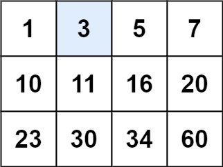
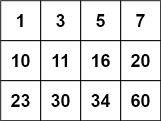

# Problem
https://leetcode.com/problems/search-a-2d-matrix/

You are given an `m x n` integer matrix matrix with the following two properties:

    Each row is sorted in non-decreasing order.
    The first integer of each row is greater than the last integer of the previous row.

Given an integer target, return true if target is in matrix or false otherwise.

You must write a solution in `O(log(m * n))` time complexity.


### Example 1:


    Input: matrix = [[1,3,5,7],[10,11,16,20],[23,30,34,60]], target = 3
    Output: true

### Example 2:


    Input: matrix = [[1,3,5,7],[10,11,16,20],[23,30,34,60]], target = 13
    Output: false

 
### Constraints:

    m == matrix.length
    n == matrix[i].length
    1 <= m, n <= 100
    -104 <= matrix[i][j], target <= 104

# Solution
Basically the problem is about doing binary search on a matrix because we’re being asked to find a target in `O(log m*n)` time.

## Getting the middle in a matrix

The first thing we need to find out is how to get(and maintain) the middle element in a matrix.

For,

- `m` = # rows
- `n` = # columns

Since we're dealing with two dimensions, `min` and `max` should be arrays with the following starting values:

- `min[r][c]`: [0][0], where r = row and c = column coordinate
- `max[r][c]`: [m-1][n-1]

Then, to get the middle coordinates we would do:

```go
r = min[r] + (max[r] - min[r]) / 2
c = min[c] + (max[c] - min[c]) / 2
```

For example 1 the middle coordinate would be:

```go
//Start values of min and max
min[r][c] = [0][0]
max[r][c] [2][3]

//Start value of middle coordinate
r = min[r] + (max[r] - min[r]) / 2
r = 0 + (2 - 0) / 2
r = 1

c = min[c] + (max[c] - min[c]) / 2
c = 0 + (3 - 0) / 2
c = 1(rounded down)

middle = matrix[1][1] which would be 11
```

This makes sense if we look at the matrix values as an array:

```go
[[1,3,5,7],[10,**11**,16,20],[23,30,34,60]] -> number "11" falls in the middle
```

## How to update the middle

First we need to define two additional components:

- `minRow` = matrix[r][0] → this is the minimum value of the current row
- `maxRow` = matrix[r][n-1] → this is the maximum value of the current row

On this variation of binary search, since we’re searching in a two-dimensional space, it makes sense that we’d need to ask two questions to know how to update the pointer variables `min`, `max` and `middle`. Besides comparing the `middle` value with `target`, we also compare it with the minimum and maximum values of **a row**. This will allow us to know whether we should move up or down a row. 

## Algorithm
### Variables
- `r`: row coordinate of the middle value
- `c`: column coordinate of the middle value
- `middle`: the middle value of the current searchable range

### Implementation
1. **Loop condition**. The loop will run while both `min` coordinates are smaller or equal to both `max` coordinates
2. Set middle coordinates and the row's min and max values
3. We first check the happy path and return inmediately. Since we already have this values calculated, we can check them right away
    ```go
    if middle == target || target == minRow || target == maxRow {
       return true
    }
   ```

4. If the `target` is smaller than the minimum value of the current row, then we can discard all the elements after the current row. That is why we establish the new `max` coordinates to the max value of the previous row.
5. If the `target` is larger than the maximum value of the current row, then we can discard all the elements before the current row. That is why we establish the new `min` coordinates to the min value of the next row.
6. If none of the previous conditions are satisfied, this means that `target` **should be in the current row**, therefore we basically perform a regular binary search on the current row, moving only the column `c` coordinate accordingly

   > **Note**: One key to understand this solution is the relation of a conditional with the ones that appear before. A specific condition makes sense because other ones failed. 