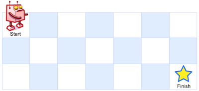

# Problem
https://leetcode.com/problems/unique-paths/description

There is a robot on an m x n grid. The robot is initially located at the top-left corner (i.e., grid[0][0]). The robot tries to move to the bottom-right corner (i.e., grid[m - 1][n - 1]). The robot can only move either down or right at any point in time.

Given the two integers m and n, return the number of possible unique paths that the robot can take to reach the bottom-right corner.

The test cases are generated so that the answer will be less than or equal to 2 * 109.


### Example 1:


    Input: m = 3, n = 7
    Output: 28

### Example 2:

    Input: m = 3, n = 2
    Output: 3
    Explanation: From the top-left corner, there are a total of 3 ways to reach the bottom-right corner:
    1. Right -> Down -> Down
    2. Down -> Down -> Right
    3. Down -> Right -> Down


### Constraints:

    1 <= m, n <= 100

# Solution
To solve this problem we must begin with the most obvious, brute-force solution which is the following: Backtracking function that recursively goes right or down and increases a counter by 1 every time we reach coordinates `grid[m - 1][n - 1]`, which is the base case.

- code

    ```go
    func uniquePaths(m int, n int) int {
    	var count int
    	var backtrack func(x, y int)
    	backtrack = func(x, y int) {
    		if x < 0 || x >= m || y < 0 || y >= n {
    			return
    		}
    
    		if x == m-1 && y == n-1 {
    			count++
    			return
    		}
    
    		backtrack(x+1, y)
    
    		backtrack(x, y+1)
    
    	}
    
    	backtrack(0, 0)
    	return count
    }
    
    ```


That solution passes all test cases locally but outputs TLE errors because it’s too slow. It has a complexity of $O(2^{m \times n})$ , exponential.

Note that what that code is doing, is asking the same question again and again for each cell of the grid without any regard for any previous calculations we might have done in other recursive calls. So we can optimize it by saving previous calculations and returning those results upon revisiting cells. We use a `memo` array, where coordinates `[i][j]` indicate “*how many ways we can reach our destination starting from cell `i,j`?*”

- code for **top-down approach**

    ```go
    func uniquePaths(m int, n int) int {
        memo := make([][]int, m)
        for i := range memo {
            memo[i] = make([]int, n)
            for j := range memo[i] {
                memo[i][j] = -1
            }
        }
    
        var dfs func(i, j int) int
        dfs = func(i, j int) int {
            if i == m-1 && j == n-1 {
                return 1
            }
            if i >= m || j >= n {
                return 0
            }
            if memo[i][j] != -1 {
                return memo[i][j]
            }
    
            memo[i][j] = dfs(i, j+1) + dfs(i+1, j)
            return memo[i][j]
        }
    
        return dfs(0, 0)
    }
    ```


---

We can get rid of the recursive calls altogether by inverting what we did in the **top-down approach**, which would be start at the destination, go backwards, and build our *current cell* with the values of the cells that are ahead(right and bottom). So now the relation would be:

```go
dp[i][j] = dp[i+1][j] + dp[i][j+1]
```

- code for **bottom-up approach**

  Note that we initialize our `dp` table with an additional row and column(`m+1, n+1`) so that our loop logic is simpler. Otherwise, we’d need to check for out of bounds inside the loop.

    ```go
    func uniquePaths(m int, n int) int {
        dp := make([][]int, m+1)
        for i := range dp {
            dp[i] = make([]int, n+1)
        }
        dp[m-1][n-1] = 1
    
        for i := m - 1; i >= 0; i-- {
            for j := n - 1; j >= 0; j-- {
                dp[i][j] += dp[i+1][j] + dp[i][j+1]
            }
        }
    
        return dp[0][0]
    }
    ```