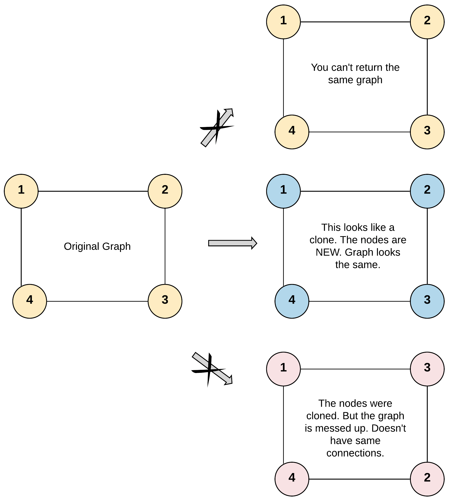
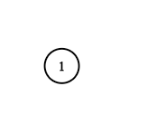

# Problem
https://leetcode.com/problems/clone-graph/description/

Given a reference of a node in a connected undirected graph.

Return a deep copy (clone) of the graph.

Each node in the graph contains a value (`int`) and a list (`List[Node]`) of its neighbors.

```java
class Node {
    public int val;
    public List<Node> neighbors;
}
```

**Test case format**:

For simplicity, each node's value is the same as the node's index (1-indexed). For example, the first node with val == 1, the second node with val == 2, and so on. The graph is represented in the test case using an adjacency list.

An adjacency list is a collection of unordered lists used to represent a finite graph. Each list describes the set of neighbors of a node in the graph.

The given node will always be the first node with val = 1. You must return the copy of the given node as a reference to the cloned graph.


### Example 1:


    Input: adjList = [[2,4],[1,3],[2,4],[1,3]]
    Output: [[2,4],[1,3],[2,4],[1,3]]
    Explanation: There are 4 nodes in the graph.
    1st node (val = 1)'s neighbors are 2nd node (val = 2) and 4th node (val = 4).
    2nd node (val = 2)'s neighbors are 1st node (val = 1) and 3rd node (val = 3).
    3rd node (val = 3)'s neighbors are 2nd node (val = 2) and 4th node (val = 4).
    4th node (val = 4)'s neighbors are 1st node (val = 1) and 3rd node (val = 3).

### Example 2:


    Input: adjList = [[]]
    Output: [[]]
    Explanation: Note that the input contains one empty list. The graph consists of only one node with val = 1 and it does not have any neighbors.

### Example 3:

    Input: adjList = []
    Output: []
    Explanation: This an empty graph, it does not have any nodes.


### Constraints:

    The number of nodes in the graph is in the range [0, 100].
    1 <= Node.val <= 100
    Node.val is unique for each node.
    There are no repeated edges and no self-loops in the graph.
    The Graph is connected and all nodes can be visited starting from the given node.

# Solution
### Rationale

We’ll clone a node by creating a new `Node` struct pointer, copying their `Val int` fields and recursively repeating the same process for each neighbor. A hash table will be used to avoid creating a node with the same value multiple times.

### Variables

- `table`: map containing the cloned nodes or nodes that are already being processed by an up-the-stack recursive call
- `cloneNode`: function used to recursively clone nodes. It will be invoked while cloning each node’s neighbors.

### Algorithm

1. Create the `table` map
2. Invoke `cloneNode` function passing the node
    1. See if the node exists on `table`. Since each node’s value is unique, we can use the `Val` field as a key to our `table`.  If the node exists on `table`, it means this node is either already fully cloned, or is being processed by another recursive call up the stack. In any case there is nothing more to do with it so we return inmediately
    2. If the node isn’t on `table`, add it, and the iterate over its neighbors:
        1. Make a recursive call to `cloneNode` for the neighbor so we can clone it
        2. Add the neighbor clone to the cloned node’s neighbor list

Since nodes are stored as pointers in both `table` and the neighbor list, we only need to update a node `X` in one place. There is no need to update `X`’s value on all its neighbors because they all point to the same reference. That is the “magic” of pointers.