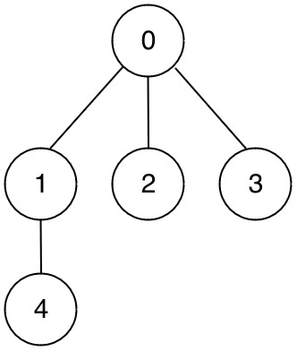
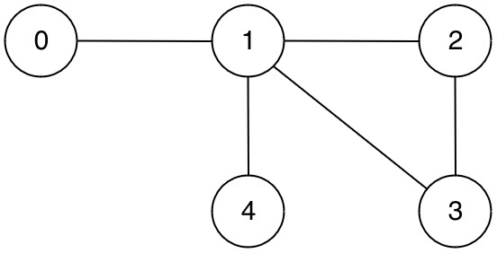

# Problem
https://leetcode.com/problems/graph-valid-tree/

Given n nodes labeled from 0 to n - 1 and a list of undirected edges (each edge is a pair of nodes), write a function to check whether these edges make up a valid tree.

### Example 1:

    
    Input: n = 5, edges = [[0,1],[0,2],[0,3],[1,4]]
    
    Output: true

### Example 2:

    Input: n = 5, edges = [[0,1],[1,2],[2,3],[1,3],[1,4]]
    
    Output: false

### Note:

- You can assume that no duplicate edges will appear in edges. Since all edges are undirected, [0, 1] is the same as [1, 0] and thus will not appear together in edges.

### Constraints:

* 1 <= n <= 2000
* 0 <= edges.length <= 5000
* edges[i].length == 2
* 0 <= a_i, b_i < n
* a_i != b_i
* There are no self-loops or repeated edges.

# Solution
### Rationale

The approach to solving this problem is checking if the graph exhibits conditions that *don’t make it* a valid tree. Which are:

1. Cycles
2. **Disconnected**. We have two or more set of edges that aren’t connected

### Algorithm

To verify the first condition we run regular DFS for detecting cycles in undirected graphs, ignoring the node we just came from to avoid false positives and infinite loops. Upon detecting a cycle we inmediately return `false`.

To verify the second condition we use a counter variable `visitedCount` which will count all the nodes we visit as we move through the entire graph in our DFS function. If at the end the count doesn’t matches the total nodes(`n`) is because we couldn’t reach every node starting from the first one(root `0`), which means the graph is disconnected. So we return `false` here.

In none of the above conditions are satisfied, the graph is a valid tree.