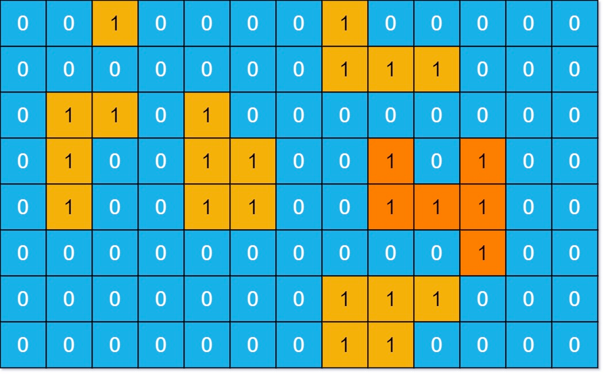

# Problem
https://leetcode.com/problems/max-area-of-island/description/

You are given an `m x n` binary matrix `grid`. An island is a group of 1's (representing land) connected 4-directionally (horizontal or vertical.) You may assume all four edges of the grid are surrounded by water.

The **area** of an island is the number of cells with a value 1 in the island.

_Return the maximum **area** of an island in_ `grid`. If there is no island, return 0.

### Example 1:

    Input: grid = [[0,0,1,0,0,0,0,1,0,0,0,0,0],[0,0,0,0,0,0,0,1,1,1,0,0,0],[0,1,1,0,1,0,0,0,0,0,0,0,0],[0,1,0,0,1,1,0,0,1,0,1,0,0],[0,1,0,0,1,1,0,0,1,1,1,0,0],[0,0,0,0,0,0,0,0,0,0,1,0,0],[0,0,0,0,0,0,0,1,1,1,0,0,0],[0,0,0,0,0,0,0,1,1,0,0,0,0]]
    Output: 6
    Explanation: The answer is not 11, because the island must be connected 4-directionally.

### Example 2:

    Input: grid = [[0,0,0,0,0,0,0,0]]
    Output: 0

### Constraints:

    m == grid.length
    n == grid[i].length
    1 <= m, n <= 50
    grid[i][j] is either 0 or 1.

# Solution
### Concepts

- `land`: 1’s in the grid
- `water`: 0’s in the grid. What is outside the grid is also considered water
- `island`: a sequence of horizontally and/or vertically adjacent 1’s that are surrounded by 0’s

### Rationale

What this problem is asking us is basically to maximize the number of horizontally/vertically adjacent 1’s. We can achieve this task by picking a land cell, going in all 4 directions to check if there are more 1’s and repeating this process for every adjacent 1, backtracking when a 0 is found. It can be observed that this is a recursive behaviour, specifically one that exhibits the characteristics of DFS where we go as deep as possible in a path before going back.

Upon visiting a cell we must mark it as visited, by transforming it’s value to 0. That way we don’t need an additional “visited” array but can use the same `grid` instead.

### Variables

- `count`: count of 1’s in the current path being explored
- `maxArea`: the return value of the function. We’ll update this value when finding a higher `count`

### Algorithm

1. Iterate over the whole `grid` and for every land cell…
    1. Increase `count` by 1 because we just found a land piece
    2. Set the cell as “0” to mark it as visited. This will prevent us from counting a land piece twice or more times
    3. Call `dfs` to recursively explore all directions of the current cell. We do this to check if the current island can be expanded
        1. Inside the recursive function we do the same: increase `count`, mark the cell as visited and recursively explore all the other 4 directions of that cell
        2. When we either reach a 0 cell or step outside the bounds of the `grid`, return(backtrack)
    4. When all recursive calls to explore the adjacent 4 directions of the current cell have returned, we will have found the maximum area for this particular island. So it is only at this point that we must update `maxCount` if required, and reset `count` to 0 because on the next iteration we’ll be looking at another island
2. Return `maxArea`