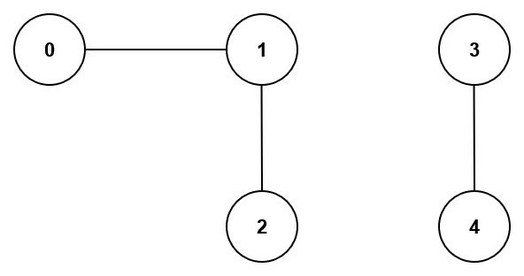
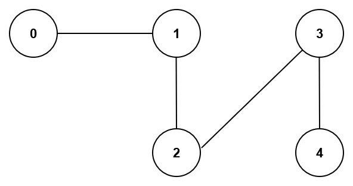

# Problem
https://leetcode.com/problems/number-of-connected-components-in-an-undirected-graph/description/

You have a graph of n nodes. You are given an integer n and an array edges where edges[i] = [aᵢ, bᵢ] indicates that there is an edge between aᵢ and bᵢ in the graph.

Return the number of connected components in the graph.

### Example 1:

    Input:
    n = 5, edges = [[0,1],[1,2],[3,4]]
    
    Output: 2

### Example 2:

    Input:
    n = 5, edges = [[0,1],[1,2],[2,3],[3,4]]
    
    Output: 1

### Constraints:

* 1 <= n <= 2000
* 1 <= edges.length <= 5000
* edges[i].length == 2
* 0 <= aᵢ <= bᵢ < n
* aᵢ != bᵢ
* There are no repeated edges.

# Solution
### Rationale

We should return the # of graphs in the input, where a single graph is counted as a sequence of connected vertices. It has to be noted that `edges` may not include all the vertices in the graph. The description doesn’t said so but I figured out by testing.

We’ll use a map `visited` that holds all `n` nodes and indicates whether they’re visited or not. We’ll iterate over the map and perform DFS over every node, granted it hasn’t been visited yet to avoid infinite loops. The DFS function by it’s nature will visit the *entire* graph starting at said node, so every time we call DFS from the map loop is because we have reached another different graph. Hence, we’ll increase our `count` variable. At the end we return `count`.