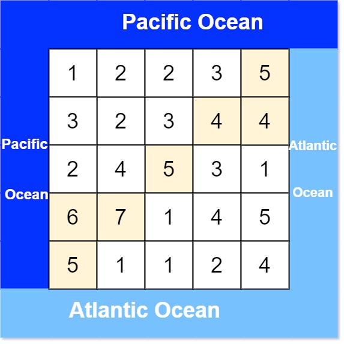

# Problem
https://leetcode.com/problems/pacific-atlantic-water-flow/description/

There is an m x n rectangular island that borders both the Pacific Ocean and Atlantic Ocean. The Pacific Ocean touches the island's left and top edges, and the Atlantic Ocean touches the island's right and bottom edges.

The island is partitioned into a grid of square cells. You are given an m x n integer matrix heights where heights[r][c] represents the height above sea level of the cell at coordinate (r, c).

The island receives a lot of rain, and the rain water can flow to neighboring cells directly north, south, east, and west if the neighboring cell's height is less than or equal to the current cell's height. Water can flow from any cell adjacent to an ocean into the ocean.

Return a 2D list of grid coordinates result where result[i] = [ri, ci] denotes that rain water can flow from cell (ri, ci) to both the Pacific and Atlantic oceans.

### Example 1:

    Input: heights = [[1,2,2,3,5],[3,2,3,4,4],[2,4,5,3,1],[6,7,1,4,5],[5,1,1,2,4]]
    Output: [[0,4],[1,3],[1,4],[2,2],[3,0],[3,1],[4,0]]
    Explanation: The following cells can flow to the Pacific and Atlantic oceans, as shown below:
    [0,4]: [0,4] -> Pacific Ocean
    [0,4] -> Atlantic Ocean
    [1,3]: [1,3] -> [0,3] -> Pacific Ocean
    [1,3] -> [1,4] -> Atlantic Ocean
    [1,4]: [1,4] -> [1,3] -> [0,3] -> Pacific Ocean
    [1,4] -> Atlantic Ocean
    [2,2]: [2,2] -> [1,2] -> [0,2] -> Pacific Ocean
    [2,2] -> [2,3] -> [2,4] -> Atlantic Ocean
    [3,0]: [3,0] -> Pacific Ocean
    [3,0] -> [4,0] -> Atlantic Ocean
    [3,1]: [3,1] -> [3,0] -> Pacific Ocean
    [3,1] -> [4,1] -> Atlantic Ocean
    [4,0]: [4,0] -> Pacific Ocean
    [4,0] -> Atlantic Ocean
    Note that there are other possible paths for these cells to flow to the Pacific and Atlantic oceans.

### Example 2:

    Input: heights = [[1]]
    Output: [[0,0]]
    Explanation: The water can flow from the only cell to the Pacific and Atlantic oceans.

### Constraints:

    m == heights.length
    n == heights[r].length
    1 <= m, n <= 200
    0 <= heights[r][c] <= 105

# Solution
### Rationale

A first intuition would be that starting from each cell, see if there is a path to both the atlantic and pacific oceans. This is extremely slow because it would require checking the 4 directionally adjacent directions of each cell, TWICE(one for each ocean). In the code this would look require calling a “DFS” function 8 times for each cell 💀. Obviously we wouldn’t go to cells with a higher height than the current one because water can’t flow there, so we wouldn’t need to do 8 dfs calls for *every single* cell, but still, is a very slow approach.

Instead of approaching the problem with what’s basically brute force, we start from the “solution”, i.e., the shores, and move to cells that can be reached from the shores. Cells that can be reached from *both shores* are the ones that form part of the solution. Since we started looking from both oceans, we can be certain that any cell we visit from them is already a possible candidate.

### Variables

- `dirs`: utility array that allow us to quickly go to the 4 directionally adjacent cells to a cell
- `result`: the return value of the function
- `pacific`: a boolean array of the visited cells while moving from the pacific shore
- `atlantic`: a boolean array of the visited cells while moving from the atlantic shore
- `dfs`: function that will allow us to build the path from the shores to all the cells that will form part of the solution

### Algorithm

1. After initializing all of our variables, we call the `dfs` function from every cell on both shores: top row and left column for the Pacific ocean, bottom row and right column for the Atlantic.
2. Inside `dfs`
    1. Check if this cell has been visited, if so, return inmediately to avoid infinite loops
    2. Mark the cell as visited. This means that this particular cell can be reached from this ocean
    3. Go through the 4 directionally adjacent cells from this one by calling `dfs` recursively, but only if the adjacent cell has a height ≥ the current cell’s height. Why? The problem description states that water can only flow from higher height cells to lower ones until it reaches the ocean, and since we’re going from ocean to cell, we must invert that order: lower cells → higher cells
3. Find the cells that appear in both visited arrays, `pacific` and `atlantic`. Those are the cells whose water can flow to both oceans.
    1. Since the visited matrices are mirrors of the `heights` matrix, we use the `heights` matrix’s coordinates to iterate over them.