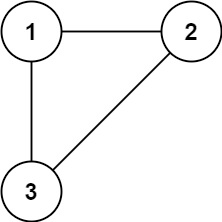
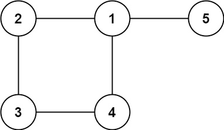

# Problem
https://leetcode.com/problems/redundant-connection/description/

In this problem, a tree is an undirected graph that is connected and has no cycles.

You are given a graph that started as a tree with n nodes labeled from 1 to n, with one additional edge added. The added edge has two different vertices chosen from 1 to n, and was not an edge that already existed. The graph is represented as an array edges of length n where edges[i] = [ai, bi] indicates that there is an edge between nodes ai and bi in the graph.

Return an edge that can be removed so that the resulting graph is a tree of n nodes. If there are multiple answers, return the answer that occurs last in the input.

### Example 1:

    Input: edges = [[1,2],[1,3],[2,3]]
    Output: [2,3]

### Example 2:

    Input: edges = [[1,2],[2,3],[3,4],[1,4],[1,5]]
    Output: [1,4]

### Constraints:

    n == edges.length
    3 <= n <= 1000
    edges[i].length == 2
    1 <= ai < bi <= edges.length
    ai != bi
    There are no repeated edges.
    The given graph is connected.

# Solution
### Rationale

The rationale behind this is that any of the edges inside a cycle can be removed without cutting-off any node from the graph/tree, precisely because those nodes are in a cycle. When you remove one of the connections of a node in a cycle, there is still another edge that connects that node with the rest of the graph.

**So our task in this problem is finding the edges that belong to a cycle, and returning the last edge from the input that appears on that set**. We return the “last edge” because the problem description says: “*If there are multiple answers, return the answer **that occurs last** in the input.*”.

### Variables

- `parent`: array that holds the parent of each node as we go do DFS on the graph. This sort of works like a stack, as it allow us to go back-up the chain of parent nodes.
- `visited`: indicates visited nodes
- `cycleStart`: indicates the start of the cycle
- `adj`: our graph representation adjacency list
- `cycleNodes`: map that stores all the nodes that belong to a cycle

### Algorithm

To detect a cycle in an undirected graph we need to identify at least one of the nodes that belongs to it. In order to achieve this we can follow a path from a node X, and if that path leads to X again it’s because we have a cycle. Therefore, we can use DFS to move through the graph keeping track of the node we just came from(parent), and if the next adjacent node has been visited and it’s not the parent, then we have found a cycle.

The “*it’s not the parent*” condition is super important here because we’re dealing with **undirected graphs**, edges go both ways. When node `A` visits node `B`, and then node `B` immediately looks at its neighbors, sees `A`, the code will mark this as a cycle just because node `A` has already been visited, when in reality these two nodes just have a bi-directional relation. A cycle only is present when the inmediate parent is not the same adjacent node.

After finding the cycle start, we can backtrack from that node to the start in order to identify all the edges that belong to the cycle. Then, we iterate over `edges` starting from the back to find the first edge that belongs to the cycle. We start from the back because we need to return the last one according to the problem description.

1. Build the graph in `adj`. Since this is an undirected graph, each of the nodes of an edge reference each other
2. Call `dfs` on the first node 0. On this implementation we’re using 0-based indexing, so we treat our adjacency list like a regular array: when talking about node 1, we reference index 0 and so on. The problem states that nodes go from 1 to N, so this means there will always be a node 1, so this is the one we call on the first `dfs` invocation. Inside the DFS function:
    1. Mark the node as visited.
    2. Iterate over all its neighbors
        1. If a neighbor hasn’t been visited, mark the current node as its parent in the `parent` array and call `dfs` on it
        2. If the neighbor has been visited and it’s not the same node as the current node’s parent, then we have found a cycle. So mark the current node as the neigbor’s parent and set the value of `cycleStart`
3. After `dfs` finishes, populate `cycleNodes` with the parent chain starting at `cycleStart`, because all the nodes that lead up to cycleStart belong to a cycle
4. Iterate over `edges` starting from the back and return the first edge whose nodes appear both on `cycleNodes`