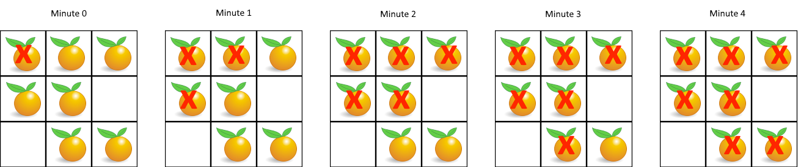

# Problem
https://leetcode.com/problems/rotting-oranges/description/

You are given an m x n grid where each cell can have one of three values:

    0 representing an empty cell,
    1 representing a fresh orange, or
    2 representing a rotten orange.

Every minute, any fresh orange that is 4-directionally adjacent to a rotten orange becomes rotten.

Return the minimum number of minutes that must elapse until no cell has a fresh orange. If this is impossible, return -1.

### Example 1:

    Input: grid = [[2,1,1],[1,1,0],[0,1,1]]
    Output: 4

### Example 2:

    Input: grid = [[2,1,1],[0,1,1],[1,0,1]]
    Output: -1
    Explanation: The orange in the bottom left corner (row 2, column 0) is never rotten, because rotting only happens 4-directionally.

### Example 3:

    Input: grid = [[0,2]]
    Output: 0
    Explanation: Since there are already no fresh oranges at minute 0, the answer is just 0.

### Constraints:

    m == grid.length
    n == grid[i].length
    1 <= m, n <= 10
    grid[i][j] is 0, 1, or 2.

# Solution
### Rationale

The first thing to note here is that rot expands widely, every 4-directionally adjacent cell of every rotten cell is infected *at the same time*, i.e., in the same “minute”. This is a breadth-like behavior which can be modeled using BFS.

### Variables

- `mins`: The min amount of minutes that have to pass so that all oranges are rotten. This is the return value of the function
- `dirs`: A utility array that allows us to go through every 4-directionally adjacent cell of a cell, in a easy way
- `queue`: A queue we’re we’ll put all the rotten oranges. This is the most important structure of the problem because it’s what indicates the rotten cells and allows us to know what will be the new rotten cells on the next minute
- `freshCount`: Count of fresh oranges. It tells us whether we managed to make all oranges rotten or if that’s impossible and we should return -1, as the problem states

### Algorithm

As stated, the approach involves using BFS to process all the rotten cells *at once* using a queue. That is the key: we must increase `mins` only after having processed ALL of the currently rotten cells, in other words, after having infected every 4-directionally adjacent orange.

1. We initialize our queue with all the rotten cells before having infected any orange, while at the same time, building our `freshCount` to know how many fresh oranges there are initially
2. After this point is pertinent to do some validation.
    1. If there are no fresh oranges we return 0 inmediately as this means that 0 minutes have to pass before all cells are rotten
    2. If the queue is empty, it means there are no rotten oranges, so its impossible to rot any other orange. Therefore, return -1
3. While the queue is not empty do the following
    1. Record the size of the queue in `size`. **This is key** because inside this loop the queue will change size multiple times, so we can’t use something like `queue.size()
    2. Move over `queue` while `size > 0` and do the following:
        1. Dequeue a `node`
        2. Decrease `size`
        3. With every cell to `node` that is both 4-directionally adjacent **AND** fresh, do the following:
            1. Infect them(transform to 2). Use the `dirs` array to do this quickly
            2. Enqueue them, so that they are processed on the next minute.
            3. Decrease `freshCount`
        4. **Why use `size > 0` instead of `queue.size() > 0`?** The queue will change size as we move through this loop and to be able to easily separate levels of expansion in the BFS movement. Using `size` ensures that we only process the elements of a *single level*(single minute) at a time, which is what we need. When the `size` value is set, the queue ONLY has the oranges that are N levels apart from the initial rotten oranges. There is not a mixup of oranges. We don’t have some that are N-1, N+1 or N+2 levels separate from the first one. All are at the same level. Thanks to this separation we can easily count `mins`.
    3. Increase `mins` by 1. After processing all the currently rotten oranges is that we’re able to increase `mins`
4. If there are no more fresh oranges, return `mins - 1`
    1. We subtract 1 because of how our loop is structured. On the last iteration `mins` is still increased by 1 despite not being any more oranges to infect, so we subtract 1 to maintain our `mins` count accurate.
5. Else, return -1