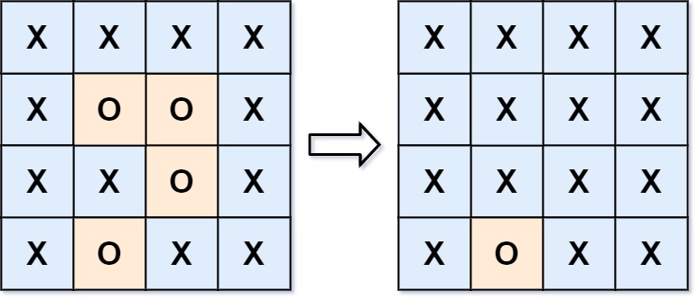

# Problem
https://leetcode.com/problems/surrounded-regions/description/

You are given an m x n matrix board containing letters 'X' and 'O', capture regions that are surrounded:

    Connect: A cell is connected to adjacent cells horizontally or vertically.
    Region: To form a region connect every 'O' cell.
    Surround: A region is surrounded if none of the 'O' cells in that region are on the edge of the board. Such regions are completely enclosed by 'X' cells.

To capture a surrounded region, replace all 'O's with 'X's in-place within the original board. You do not need to return anything.

### Example 1:

    Input: board = [["X","X","X","X"],["X","O","O","X"],["X","X","O","X"],["X","O","X","X"]]
    
    Output: [["X","X","X","X"],["X","X","X","X"],["X","X","X","X"],["X","O","X","X"]]
    
**Explanation**:

In the above diagram, the bottom region is not captured because it is on the edge of the board and cannot be surrounded.

### Example 2:

    Input: board = [["X"]]
    
    Output: [["X"]]

### Constraints:

    m == board.length
    n == board[i].length
    1 <= m, n <= 200
    board[i][j] is 'X' or 'O'.

# Solution
### Observations

- If a cell is on the edge of the board(whether be an ‘X’ or an ‘O’) it can’t be surrounded so you should ignore it
- A region is “surroundable” only if **NONE** of the “O” cells are in an edge, again, **NONE**. This means that in a region of 10 O’s, if just one of those 10 O’s touches an edge, then we can’t convert the entire region to X’s

### Rationale

The easiest way to do this is using a “reversed” approach, meaning, instead of looking for regions that can be surrounded as the problem description says, we’ll first look at regions that **cannot** be surrounded and then mark as surroundable every other region. Why? Is a lot easier to find unsurroundable regions(find an O in an edge) than to find surroundable regions, which can be anywhere on the `board`.

Hence, the approach would be moving through the edges searching for O’s, start building a region from them and expand the region as much as possible using DFS with the 4 directionally adjacent cells, and then surround every cell that isn’t reachable from the O’s in the edges.

### Algorithm

1. Iterate over the edges of `board`
    1. If the cell is an “X”, continue
    2. If a cell is “O” try to expand the region as much as possible using a DFS approach. This region cannot be surrounded because there is a O at the edge, the one you just started from.
        1. All that expandable region must be marked as “visited”(we’ll call them `resilient` for mnemonic purposes) in some way, so that other iterations don’t repeat the same process.
            1. We’ll use the value of “1” to denote a “resilient” cell. In other words, a cell `board[r][c]` is resilient when `resilient[r][c] == 1`.
2. All the remaining cells can be confidently marked as X’s because we have already identified the regions that can’t be surrounded.
    1. When I say “remaining”, I’m talking about two types of cells
        1. **The ones that already are “X”**. We could ignore those since they’re X already, but this would require more code. Is simple to just set them again(which would be a no-op anyway).
        2. The O’s that **are not** marked as `resilient`, as this are the ones that can be surrounded.