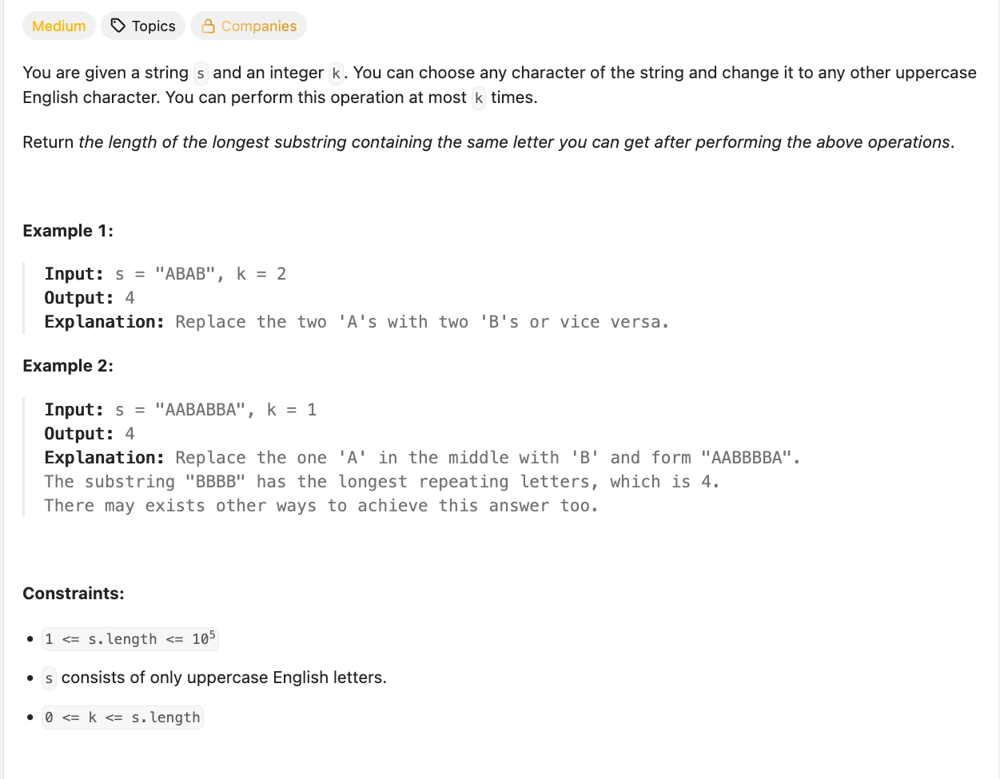

# Problem
https://leetcode.com/problems/longest-repeating-character-replacement/description



# Solution

## Main actors
- `freq`: map that holds the frequencies of each letter. This will help us to know which is the most frequent letter so far. 
- `curLen`: current length of the window we're examining. 
- `maxFreq`: holds the frequency of the most frequent letter we have found in the current window. 
- `maxLength`: holds the length of the maximum window we have found so far. This will be the longest repeating character substring that the problem is asking us to find.

## Implementation
The algorithm relies on two important facts:
- Since we're being asked to find "the length of the longest substring" we know this is a **sliding window** problem.
- The longest substring will always be formed with the most frequent letter on `s` before doing any transformations. 

To find the most frequent letter we create a frequency map `freq` that will be updated on each iteration
```go
if val, ok := freq[string(s[j])]; ok {
    freq[string(s[j])] = val + 1
} else {
    freq[string(s[j])] = 1
}
```
---
We then update`maxFreq` if necessary, then ask wether `curLen-maxFreq > k` or not. This is the other important part of the algorithm. Subtracting the frequency of the most frequent letter from the length of the current window results in the quantity of letters that **are not** the most frequent one. We could name this result "`charsToChange`" for convenience. As the name implies, `charsToChange` indicates how many **transformations**(`k`) we have to make to change all those letters to the most frequent. _This is the condition that dictates the behaviour of the sliding window_.   

If we need to change more characters than we are allowed to(indicated by `k`), we must shrink the window because if we don’t, then our resulting window will need more replacements than the ones allowed by k. We also need to update `freq` because the current value of `i` should not be taken into consideration in further iterations.

```go
maxFreq = max(freq[string(s[j])], maxFreq)
if curLen-maxFreq > k {
    freq[string(s[i])]--
    i++
    continue
}

```

## Clarifications
- **If this is a sliding window problem, why do both index pointer variables `i` and `j` being at the same index `0`?** It makes the code more concise and simple, as we don't have to deal with weird edge cases such as: what to do if `s` has length 0 or 1? or having to initialize `freq` with the first letter of `s`.  
