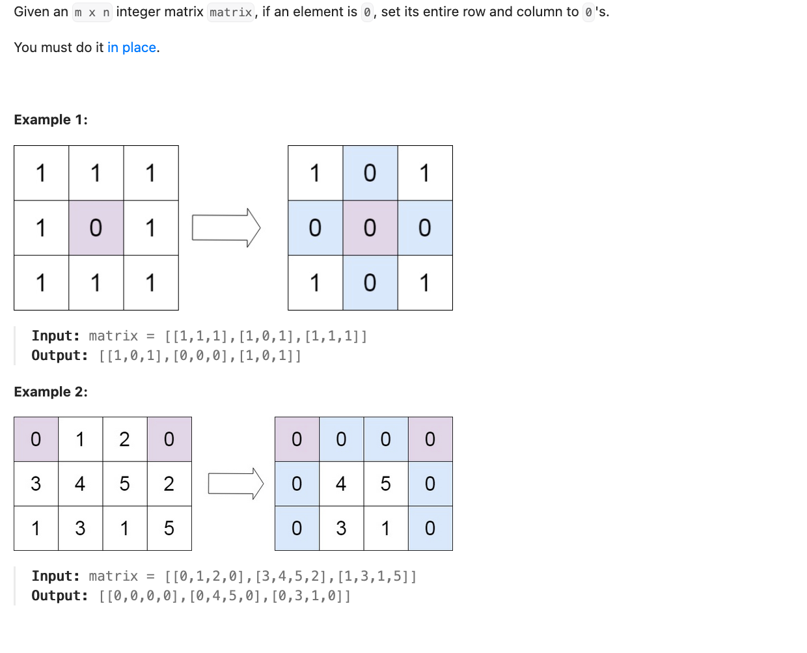
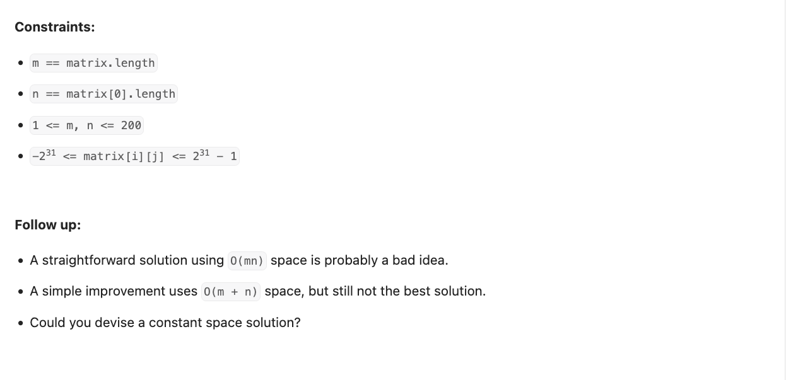

# Problem
https://leetcode.com/problems/set-matrix-zeroes/description




# Solution
1. Iterate over the whole matrix
2. Use a hashmap `zeroes` to save the "coordinates"(row `i` and column `j`) where a zero appears.
3. Iterate a second time over the same matrix(do not create another one) and do the following:
    1. If the current row `i`appears on `zeroes`, all the items of the row should be zeroes
    2. If the current column `j` appears on `zeroes`, all the items of the column should be zeroes.

## Implementation details
- `zeroes` is of type `map[string]map[int]struct{}` because the first key indicates whether the zero appears on a row or column. For example, for an input matrix `[0,1,2,0],[3,4,5,2],[1,3,1,5]]`, the `zeroes` map would have the following values:
  ```json
   {
     "row": {
         0: {}   
      },
      "column": {
         0: {},
         3: {},
      } 
   }

