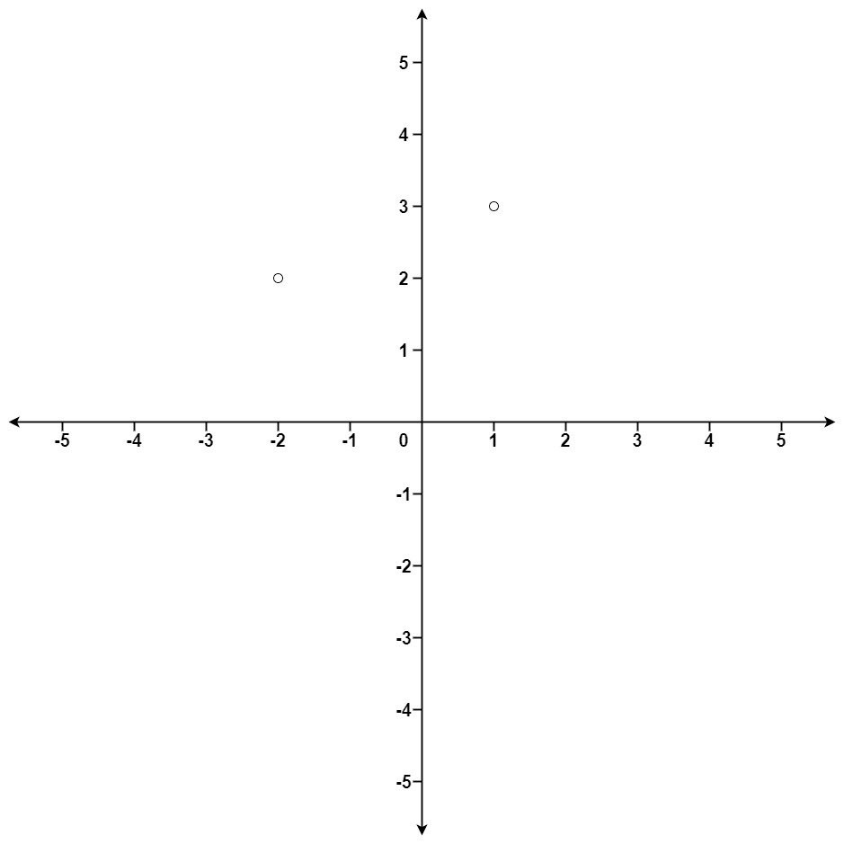

# Problem
https://leetcode.com/problems/k-closest-points-to-origin/description/

Given an array of points where points[i] = [xi, yi] represents a point on the X-Y plane and an integer k, return the k closest points to the origin (0, 0).

The distance between two points on the X-Y plane is the Euclidean distance (i.e., √(x1 - x2)2 + (y1 - y2)2).

You may return the answer in any order. The answer is guaranteed to be unique (except for the order that it is in).

### Example 1:

    Input: points = [[1,3],[-2,2]], k = 1
    Output: [[-2,2]]
    Explanation:
    The distance between (1, 3) and the origin is sqrt(10).
    The distance between (-2, 2) and the origin is sqrt(8).
    Since sqrt(8) < sqrt(10), (-2, 2) is closer to the origin.
    We only want the closest k = 1 points from the origin, so the answer is just [[-2,2]].

### Example 2:
    
    Input: points = [[3,3],[5,-1],[-2,4]], k = 2
    Output: [[3,3],[-2,4]]
    Explanation: The answer [[-2,4],[3,3]] would also be accepted.

### Constraints:

    1 <= k <= points.length <= 104
    -104 <= xi, yi <= 104

# Solution
1. Keep a max heap of size `k`. This will hold the euclidian distances of the closest points to the origin.
2. Calculate the distances of all the points
    1. While the max heap’s size is less than `k`, OR if a new distance is smaller than the heap’s root, keep adding distances
    2. When the heap has a size larger than `k`, remove the root. The root is the largest element on the max heap, meaning, the max distance. Since we want to hold only the `k` smallest distances, we need to remove the largest one.