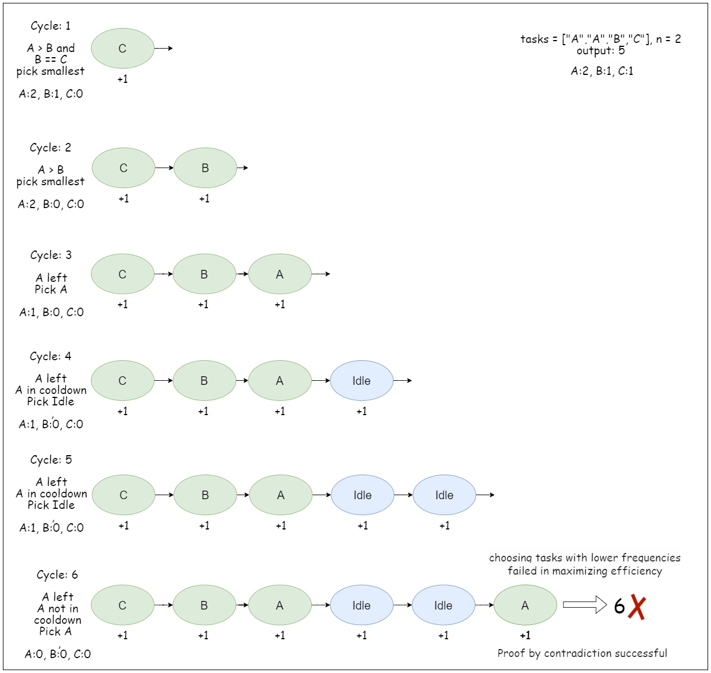
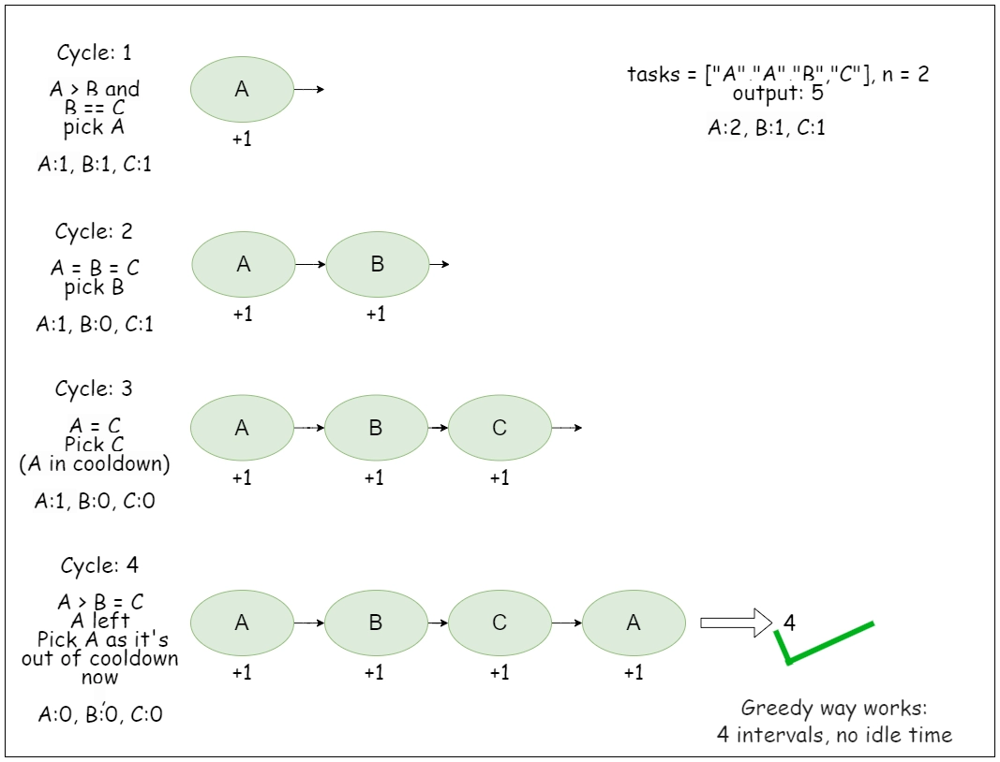

# Problem
https://leetcode.com/problems/task-scheduler/description/

You are given an array of CPU `tasks`, each labeled with a letter from A to Z, and a number n. Each CPU interval can be idle or allow the completion of one task. Tasks can be completed in any order, but there's a constraint: there has to be a gap of at least n intervals between two tasks with the same label.

Return the **minimum** number of CPU intervals required to complete all tasks.


### Example 1:
    
    Input: tasks = ["A","A","A","B","B","B"], n = 2
    
    Output: 8
    
    Explanation: A possible sequence is: A -> B -> idle -> A -> B -> idle -> A -> B.
    
    After completing task A, you must wait two intervals before doing A again. The same applies to task B. In the 3rd interval, neither A nor B can be done, so you idle. By the 4th interval, you can do A again as 2 intervals have passed.

### Example 2:
    
    Input: tasks = ["A","C","A","B","D","B"], n = 1
    
    Output: 6
    
    Explanation: A possible sequence is: A -> B -> C -> D -> A -> B.
    
    With a cooling interval of 1, you can repeat a task after just one other task.

### Example 3:

    Input: tasks = ["A","A","A", "B","B","B"], n = 3
    
    Output: 10
    
    Explanation: A possible sequence is: A -> B -> idle -> idle -> A -> B -> idle -> idle -> A -> B.
    
    There are only two types of tasks, A and B, which need to be separated by 3 intervals. This leads to idling twice between repetitions of these tasks.


### Constraints:

    1 <= tasks.length <= 104
    tasks[i] is an uppercase English letter.
    0 <= n <= 100

# Solution
### Clarifications

- An interval means that “**a** **something”** needs to happen between two tasks of the same letter. That something can be either a task of another letter or an idle time.
- Tasks represented by the same character are considered identical
- A task is represented by a teller, so we’ll use the terms “letter” and “task” interchangeably.

---

First of all, is important to note that always choosing the letter with the highest frequency leads to a more efficient outcome(less time spent by the CPU). Let’s look at an example to illustrate this:


_Choosing tasks with lower frequencies_


_Choosing tasks with higher frequencies_

We’ll use a max heap in the form of a priority queue for this. A priority queue will allow us to instantly access the element with the highest frequency in O(1) time. We’ll continuosly remove the largest frequencies from the queue to signify that a task is being processed. If after processing it one time, the task has more frequencies, we’ll rebuild the max heap with the remaining frequencies of each task.

### Cooldown period

In the code, the cooldown period is defined by $n + 1$ which is kept on the variable `cycle`, but, *what is the cooldown period?* Indicates how many events need to happen before a task of the same letter is repeated in the sequence. For example, for tasks `["A", "A", "B", "B"]` and `n = 2`, 3(N+1) events need to happen before A is done again: `A - B - idle - A...`.

Let’s use an example:

Imagine you have tasks **`["A", "A", "B", "B"]`** and **`n = 2`**.
Your cycle size or cooldown period (`n + 1`) is **3**.

**Cycle 1:**

- You pop `A` and `B` from the heap. The heap is now empty, so the inner loop breaks. `taskCount = 2`.
- You decrement their frequencies and push `A` and `B` back into the heap (they each have 1 left).
- **Check:** Is the heap empty? **No.**
- **Action:** `time += 3` (Because the CPU ran `A -> B -> Idle` to satisfy the cooldown for A and B). To repeat `A` we have to wait `n + 1` time.

**Cycle 2:**

- You pop `A` and `B` from the heap. The heap is empty, so the inner loop breaks. `taskCount = 2`.
- Their frequencies are now 0, so you push *nothing* back to the heap.
- **Check:** Is the heap empty? **Yes.**
- **Action:** `time += 2` (Because this was the last batch! The CPU just ran `A -> B` and finished. No need to append an Idle at the end).

**Total Time:** `3 + 2 = 5`.
Schedule visually: `[A, B, Idle, A, B]`

### Variables

- `time`: variable that accumulates the total cycles/time spent. We’ll update it on each iteration after we figure out the correct way to organize tasks. This is the return value of the function.
- `cycle`: indicates the length of a cycle, or, how much tasks or idle times have to pass before repeating a task. This variable acts as a control mechanism to prevent us from repeating a letter before its allowed(as indicated by `n`). For this reason the value of `cycle` is always `n+1`. We add 1, because the current iteration is counted. For example, given a task list (e.g., `['A', 'A', 'A', 'B', 'B', 'B']`) and a cooldown period `n` (e.g., 2), the first sequence of tasks would be:

    ```jsx
    A-B-IDLE-A
    ```

  Let’s say that our current iteration corresponds to the first A. Since the current letter is counted, we count… 1(A), 2(B), 3(IDLE) which is `n + 1` before adding another A. Doing `cycle = n` would lead us to having the sequence `A-B-A`.

- `store`: Temporary array that stores the frequencies of tasks that still need to be processed.
- `taskCount`: number of tasks processed in the current cycle

### Algorithm

1. Initialize an array `freq` of size 26 to store the frequency of each task. Iterate through the `tasks` array and update the frequency of each task in the `freq` array.
    1. `freq` will allow us to build a max heap so that we can later easily pick the letter with the highest frequency on each iteration.
2. Build the max heap `heap` using `freq`.
3. While the priority queue `heap` is not empty, do the following:
    1. Initialize `cycle` to `n + 1`which represents the cooling interval plus one (for the current task)
    2. Initialize `store` as an empty array
    3. Initialize a variable `taskCount` to keep track of the number of tasks processed in the current cycle.
    4. While `cycle` is greater than 0 and `heap` is not empty, repeat the following steps:
        1. Decrement `cycle`.
        2. Pop the top element (`task` frequency) from the priority queue.
        3. If the popped frequency is greater than 1, decrement it by 1 and store it in the `store` array. This means that this specific tasks still needs to be processed later, so we store it on this array to rebuild `heap` and continue processing more tasks in subsequent iterations.
        4. Increment `taskCount` as it keeps track of the number of tasks processed in the current cycle.
            
           ------------------

           **The condition `cycle > 0 && !heap.isEmtpy()` is the key part of this algorithm**. We can only add tasks for processing(increase the count) while being inside the cooldown period, which is signaled by `cycle > 0`. This is what dictates the maximum amount of tasks we can process. If after this inner loop there are no pending tasks(heap is empty) then we can safely add `taskCount` to `time`. Otherwise, we need to add `n+1`(which is the starting value of `cycle`). It is thanks to the `cycle > 0` condition that we can safely add `n + 1` to `time` when there still are pending tasks. With this condition we’re saying: “process *at most* N+1(`cycle`) tasks, if after this there are still tasks to process then increase the timer by the task we just processed(N+1); otherwise, increase it only by `taskCount`". Without this safeguard the `time` and the actual tasks being taken out of the heap would differ.

           The second component(`!heap.isEmtpy()`) of the condition acts as a safety check to prevent access to an empty heap.

    5. After processing tasks in the cycle, restore the updated frequencies (stored in the `store` array) back to `heap`
    6. **Update `time`**.
        1. If the heap is empty we add `taskCount`, because at this point in the code, `heap` being empty means there are no more tasks to process so there is not need to add any idle time.
        2. On the other hand, if `heap` has elements then it means we still have tasks to process so we must increase `time` by `n + 1`. Why by this amount? Remember that `n + 1` means *cooldown* period, or, how much time we have to wait before repeating a task. Since `heap` still has elements, this implies there are tasks that must be repeated. However, to repeat them again and begin another cycle safely we must wait `n + 1` time.
4. Return `time`.