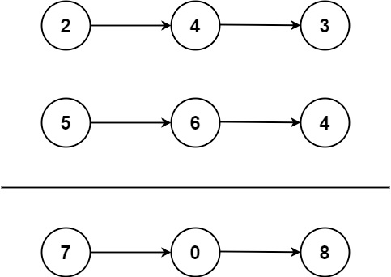

# Problem
https://leetcode.com/problems/add-two-numbers/description/

You are given two **non-empty** linked lists representing two non-negative integers. The digits are stored in **reverse order**, and each of their nodes contains a single digit. Add the two numbers and return the sum as a linked list.

You may assume the two numbers do not contain any leading zero, except the number 0 itself.

### Example 1:

    Input: l1 = [2,4,3], l2 = [5,6,4]
    Output: [7,0,8]
    Explanation: 342 + 465 = 807.

### Example 2:

    Input: l1 = [0], l2 = [0]
    Output: [0]

### Example 3:

    Input: l1 = [9,9,9,9,9,9,9], l2 = [9,9,9,9]
    Output: [8,9,9,9,0,0,0,1]

### Constraints:

    The number of nodes in each linked list is in the range [1, 100].
    0 <= Node.val <= 9
    It is guaranteed that the list represents a number that does not have leading zeros.

# Solution
### In a nutshell

This problem is solved using the classic column method of elementary mathematics, adding up two elements of the same column(in this case, node) and a carrying when the sum of a column is higher than 10.

### Variables

- `carry int`: left digit of a sum that produces a number higher than 9. If the sum outputs 18, `carry` will have a value of “1”.
- `resHead`: the head of the output linked list
- `curRes`: pointer to the tail of the output linked list. This is the pointer that will keep the sum of the current nodes being added up

### Algorithm

1. Iterate over both lists simultaneously
    1.  add up the values of each list and put the result as a new node of the resulting linked list
        1. If `sum >= 10`, we calculate the carry and set the sum digit as our current node’s value
        2. Else, we set the sum as our current node’s value and, **importantly**, set `carry` to 0 to prevent the carry from previous digits/nodes that have nothing to do with the current one affect the calculation
    2. Move `curRes` to it's "next" position only if one of the input lists still has a “next” node. Why the constraint? To avoid having a trailing zeroes.
    3. Move `l1` and `l2` to their next positions to continue processing the other elements.
2. Perform the exact same process on the list that still has elements left to process.
    1. **Note** that `carry` might not be 0 thanks to the last sum of the previous loop.
3. Lastly, we add the value of `carry` as a last node if the last sum produced a value higher than 10