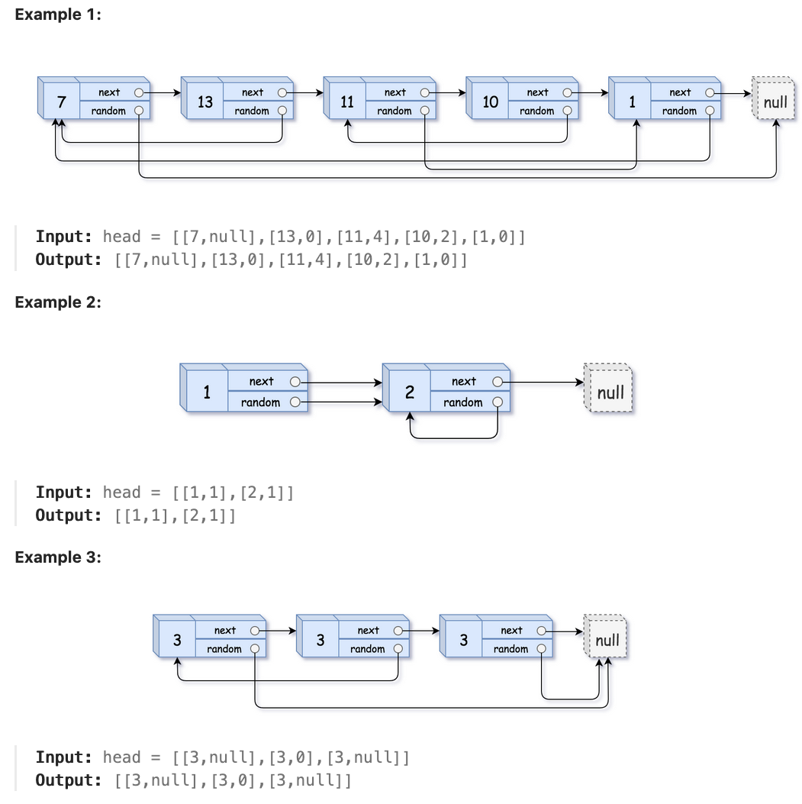

# Problem
https://leetcode.com/problems/copy-list-with-random-pointer/description/

A linked list of length n is given such that each node contains an additional random pointer, which could point to any node in the list, or null.

Construct a **deep copy** of the list. The deep copy should consist of exactly `n` **brand new nodes**, where each new node has its value set to the value of its corresponding original node. Both the next and random pointer of the new nodes should point to new nodes in the copied list such that the pointers in the original list and copied list represent the same list state. **None of the pointers in the new list should point to nodes in the original list**.

For example, if there are two nodes X and Y in the original list, where `X.random --> Y`, then for the corresponding two nodes x and y in the copied list, `x.random --> y`.

Return the head of the copied linked list.

The linked list is represented in the input/output as a list of n nodes. Each node is represented as a pair of `[val, random_index]` where:
- `val`: an integer representing Node.val 
- `random_index`: the index of the node (range from 0 to n-1) that the random pointer points to, or null if it does not point to any node.

Your code will only be given the head of the original linked list.



### Constraints:

    0 <= n <= 1000
    -10^4 <= Node.val <= 10^4
    Node.random is null or is pointing to some node in the linked list.

# Solution
## TL;DR

The algorithm is composed of the following three steps which are also 3 iteration rounds.

1. **Iterate the original list and duplicate each node**. The duplicate of each node follows its original immediately. Doing this linking with the original lists allows us to maintain space complexity as `O(1)`.
2. Iterate the new list and assign the random pointer for each duplicated node.
3. Restore the original list and extract the duplicated nodes.

## Variables

- `og *Node`: iterator used to point to the original list

## Implementation

### **Iterate the original list, make a duplicate of each node placed directly after the original one**

```go
func copyRandomList(head *Node) *Node {
	og := head
	var next, copyNode *Node

	for og != nil {
		next = og.Next

		copyNode = &Node{
			Val:  og.Val,
			Next: next,
		}

		og.Next = copyNode
		og = next
	}
//...	
}
```

After this loop we’ll end up with a list like this:

```
7 -> 7' -> 13 -> 13' -> 11 -> 11' -> 10 -> 10' -> 1 -> 1'
Where the nodes with ‘ are the copies. 
```

**This means that every other node in the list is a copy of the original one**. It’s a key fact that makes this algorithm work. The rest of the code only works because of this.

### Assign random pointer to each duplicated node

```go
	//...
	cur := head
	for cur != nil {
		if cur.Random != nil {
			cur.Next.Random = cur.Random.Next
		}

		cur = cur.Next.Next
	}
	//...
```

Remember, as established on the previous section, every other node is a copy of the original node that preceeds it. On this loop, we iterate over the original nodes *exclusively*, this is why on every iteration we move the `cur` pointer two places ahead instead of one. Hence, the `cur` variable will always point to an original node and by extension, the [`cur.next`](http://cur.next) pointer will always point to a copy node. Bear that in mind.

So, if the current original node has a random pointer, we set that pointer as the “random” of the corresponding copy node(`cur.next`). That line is a little confusing, so, for reference:

- [`cur.Next`](http://cur.Next) → copy node, the one we’re building
- `cur` → the original node for which [`cur.Next`](http://cur.Next) is a copy of

**Why iterate ONLY over the original nodes instead of the copied ones?** Because the original nodes are the ones that have the random pointer set from the get go, not the copied nodes. How will we set the random pointers to the copy nodes if we can’t easily access the random pointers of the original nodes? This is why.

### Restore the original list and extract the duplicated nodes

**Variables**

- `og *Node`: iterator used to point to the original list
- `nextOg`: the next pointer of the original node
- `dummyHead`: dummy node used to simplify the logic of handling nil node values. The purpose of this node is avoiding adding an `if copyOg != nil` inside the loop.
- `copyNode`: copy node of the current iteration/current original node
- `copyOg`: copy node of the previous iteration

```go
	og = head
	var nextOg *Node
	dummyHead := &Node{Val: 0}
	copyNode, copyOg := dummyHead, dummyHead

	for og != nil {
		nextOg = og.Next.Next

		copyNode = og.Next
		copyOg.Next = copyNode
		copyOg = copyNode

		og.Next = nextOg
		og = nextOg
	}
	
	return dummyHead.Next
```

Here we separate the copy list from the original one to leave the original list in it’s base state, which is one of the constraints of the problem, and also to get the copy list entirely severed-off the original list.

We first save the “next” of the original node in `nextOg`. Since on this point the list is still intertwined with copy nodes, this node is two places ahead of the original node. We’ll use this variable to place the real “next” of the original node right next to it.

We then take the current copy node(`copyNode`) and place it as “next” of the previous copy node(`copyOg`), efectively chaining the copied nodes together.

Set the true “next” node of the original node by using the previously set `nextOg` variable.

Then move `og` to `nextOg`,  in order to continue processing the remaining elements.