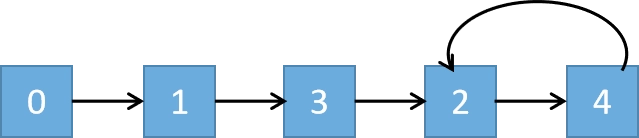

# Problem
https://leetcode.com/problems/find-the-duplicate-number/

Given an array of integers nums containing n + 1 integers where each integer is in the range [1, n] inclusive.

There is only one repeated number in nums, return this repeated number.

You must solve the problem without modifying the array nums and using only constant extra space.


### Example 1:

    Input: nums = [1,3,4,2,2]
    Output: 2

### Example 2:

    Input: nums = [3,1,3,4,2]
    Output: 3

### Example 3:

    Input: nums = [3,3,3,3,3]
    Output: 3


### Constraints:

    1 <= n <= 105
    nums.length == n + 1
    1 <= nums[i] <= n
    All the integers in nums appear only once except for precisely one integer which appears two or more times.

# Solution
The key to the solution is treating the input array `nums` as a linked list, where the value of every node is an index `i`, and the “next” pointer of each node is `nums[i]`. For example, for `nums = [1,3,4,2,2]`, the linked list would look something like:



So, `nums[1] = 3`, which means that node 1 points to node 3

After doing that, finding the duplicate number can be done by just finding the cycle in the list. A task that can be done using the **fast and slow pointers** technique with two twists:

1. It must be applied to arrays
2. We need to find the node(duplicate) that has two other nodes pointing to it. Note that the regular fast and slow pointer technique only indicates that there is a cycle in the list. It doesn’t tell us which is the node that has two other nodes pointing to it, so we must use the tecnique a little differently.

## Algorithm

1. We first find the point at which both nodes intersect, which might not be the duplicate node. In the example `nums = [1,3,4,2,2]`, the intersection point is 4.

    ```go
    func findDuplicate(nums []int) int {
    	slow, fast := nums[0], nums[nums[0]]
    
    	for slow != fast {
    		slow = nums[slow]
    		fast = nums[nums[fast]]
    	}
    	//...
    }
    ```

   Remember, the fast and slow pointers technique just tells us weather there is a cycle in the list or not by detecting the node at which both pointers meet which **is not the same** as the node that two nodes point to. I know this is confusing, so let’s illustrate this loop’s execution with the aforementioned example:

   First, let's map out how this array acts as a linked list. Remember, the **index** is our current position, and the **value** is the next index we jump to.

   If you follow the path starting from index 0, it looks like this:
   `0 → 1 → 3 → 2 → 4 → 2` (and now we are trapped in the cycle between 2 and 4).

   ### Step-by-Step Execution of Phase 1

   We start with both pointers at the "head" of our list (index `0`).

   **Initialization:**

    - `slow` = 0
    - `fast` = 0

   **Step 1:**

    - `slow` moves 1 step: `nums[0]` → **1**
    - `fast` moves 2 steps: `nums[nums[0]]` → `nums[1]` → **3**
    - *Current positions:* `slow` is at 1, `fast` is at 3. They don't match, so we continue.

   **Step 2:**

    - `slow` moves 1 step: `nums[1]` → **3**
    - `fast` moves 2 steps: `nums[nums[3]]` → `nums[2]` → **4**
    - *Current positions:* `slow` is at 3, `fast` is at 4. They don't match, so we continue.

   **Step 3:**

    - `slow` moves 1 step: `nums[3]` → **2**
    - `fast` moves 2 steps: `nums[nums[4]]` → `nums[2]` → **4**
    - *Current positions:* `slow` is at 2, `fast` is at 4. They don't match, so we continue.

   **Step 4:**

    - `slow` moves 1 step: `nums[2]` → **4**
    - `fast` moves 2 steps: `nums[nums[4]]` → `nums[2]` → **4**
    - *Current positions:* `slow` is at 4, `fast` is at 4.

   **Boom!** `slow == fast` (4 == 4). The pointers have collided inside the cycle. The `do-while` loop breaks, and Phase 1 is complete.

   Notice that they met at **4**. But the duplicate number in the array is **2**. This perfectly demonstrates why Phase 1 alone isn't enough to solve the problem—it only proves the cycle exists and gives us a meeting point.

2. We then set `slow = 0` and leave `fast` where it is, and move both pointers at the same time, one step at a time. The point at which they meet is the duplicate number:

   ### Step-by-Step Execution of Phase 2

   **Initialization:**

    - We reset `slow` back to the very beginning of the array: `slow = 0`.
    - We leave `fast` exactly where it is: `fast = 4`.
    - *Crucial change:* Both pointers will now move at the exact same speed (1 step at a time).

   **Step 1:**

    - `slow` moves 1 step: `nums[0]` → **1**
    - `fast` moves 1 step: `nums[4]` → **2**
    - *Current positions:* `slow` is at 1, `fast` is at 2. They don't match, so we continue.

   **Step 2:**

    - `slow` moves 1 step: `nums[1]` → **3**
    - `fast` moves 1 step: `nums[2]` → **4**
    - *Current positions:* `slow` is at 3, `fast` is at 4. They don't match, so we continue.

   **Step 3:**

    - `slow` moves 1 step: `nums[3]` → **2**
    - `fast` moves 1 step: `nums[4]` → **2**
    - *Current positions:* `slow` is at 2, `fast` is at 2.

   **Boom!** `slow == fast` (2 == 2). The `while` loop breaks.

[//]: # (   We return `slow` &#40;which is **2**&#41;, and that is exactly the duplicate number in our array!)
