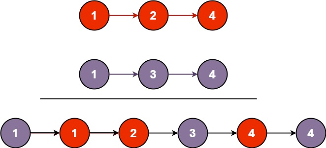

# Problem
https://leetcode.com/problems/merge-two-sorted-lists/description/

You are given the heads of two sorted linked lists `list1` and `list2`.

Merge the two lists into one **sorted list**. The list should be made by splicing together the nodes of the first two lists.

Return the head of the merged linked list.

### Example 1:

    
    Input: list1 = [1,2,4], list2 = [1,3,4]
    Output: [1,1,2,3,4,4]

### Example 2:

    Input: list1 = [], list2 = []
    Output: []

### Example 3:

    Input: list1 = [], list2 = [0]
    Output: [0]

### Constraints:

    The number of nodes in both lists is in the range [0, 50].
    -100 <= Node.val <= 100
    Both list1 and list2 are sorted in non-decreasing order.

# Solution
### Variables

- `"result list"`: The sorted merged linked list that the problem is asking us to build. Note that this is not a literal variable, it is a term we use to refer to the list that starts with `head`. Remember that a linked list is technically not a variable, but a *connection* of variables(pointers). We’ll use this term to refer to the this list from now on.
- `head`: This is the head of our result linked list and the value we return from the function
- `cur`: The current node of the result list we’re evaluating. This value initially points to `head`. It will serve as the tail of the result list as we iterate through both `list1` and `list2`.

### Implementation

1. If one of the input list is empty(null), return the other.
2. **Identify the `head` of our result list**. This will be the lowest value of both lists, obviously.
    1. Move the “head” of the corresponding list one step ahead. We need to do this because at this point we have already identified the position in the resulting list of this value. If `list1 = [5]` and `list2 = [1,2,4]`, then `head = 1`. At this point we know that the node of `1` is the lowest number of both lists, so we need to do `list2 = [list2.next]` to evaluate the next node in `list2` because `1` has reached its final position.
3. `cur = head` because at this point the resulting list only has one element, so the tail and head reference the same node.
4. Iterate through `list1` and `list2` until either is `nil`.
    1. If the current node of `list1` is smaller than the current node of `list2`, then this is the value we need to place as the new tail of the resulting list, and move the head of `list1` one place ahead to evaluate the next element of `list1`.
    2. If it isn’t, then we place the value of `list2` as our new tail and do the same logic of updating the `list2` head.
    3. we do `cur = [cur.next]` to be able *extend* the resulting list.
        1. If we don’t do this we would always be updating the same node of the resulting list and we’d endup with a merged list of only two elements: the `head` we identified at the start of the function, and the last evaluated element of either of the two lists.
5. Finally, we append any remaining elements of either of the lists to the tail of the resulting list.
    1. This will happen if there is a list larger than the other. Then we’ll have unprocessed elements of that larger list.
