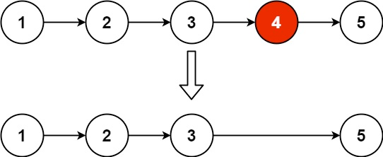

# Problem
https://leetcode.com/problems/remove-nth-node-from-end-of-list/description/

Given the head of a linked list, remove the nth node from the end of the list and return its head.

### Example 1:

    Input: head = [1,2,3,4,5], n = 2
    Output: [1,2,3,5]

### Example 2:
    
    Input: head = [1], n = 1
    Output: []

### Example 3:

    Input: head = [1,2], n = 1
    Output: [1]

### Constraints:

    The number of nodes in the list is sz.
    1 <= sz <= 30
    0 <= Node.val <= 100
    1 <= n <= sz

# Solution
### In a nutshell

Use two pointers, `left` and `right`. Move `right` `n` places, then move both pointers at the same time until `right` is `nil`. At that point, `left` will be at the $n^{th}$ node from the end.

### Implementation

1. Move `right` `n` places
2. If `right` is nil right after moving it `n` places, that means `left` is already the $n^{th}$ from the end, so we remove it by equating the `left` pointer to the next node.
3. Move both pointers at the same time until `right` is `nil`. At that point, `left` will be at the $n^{th}$ node from the end. The removal of `left` is done by connecting the previous node of `left` with the next one.
    1. Keep track of `prevLeft` to properly remove `left` without losing the rest of the list.