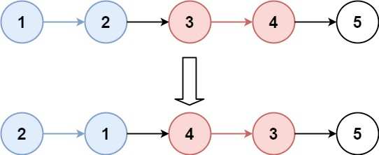
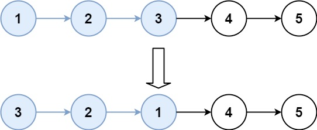

# Problem
https://leetcode.com/problems/reverse-nodes-in-k-group/description/

Given the head of a linked list, reverse the nodes of the list k at a time, and return the modified list.

k is a positive integer and is less than or equal to the length of the linked list. If the number of nodes is not a multiple of k then left-out nodes, in the end, should remain as it is.

You may not alter the values in the list's nodes, only nodes themselves may be changed.

### Example 1:

    Input: head = [1,2,3,4,5], k = 2
    Output: [2,1,4,3,5]

### Example 2:

    Input: head = [1,2,3,4,5], k = 3
    Output: [3,2,1,4,5]

### Constraints:

    The number of nodes in the list is n.
    1 <= k <= n <= 5000
    0 <= Node.val <= 1000

# Solution
### TL;DR

Iteratively reverse sections of size `k` in the list and combine them together.

### Variables

- `outHead`: head of the output result list
- `reverse`: function to reverse a a linked list. Here is used to reverse a list section of size `k`
- `revHead` and `revTail`: pointers to the head and tail of a reversed section of the list.
- `prevRevTail`: pointer to the revTail of the previous iteration. This is what allows to connect several reversed section together
- `secHead`: head of the current group being operated on

### Implementation

1. Create a `reverse` function. You’ll use this to reverse portions of the input list
    1. This function returns two pointers: `revHead` and `revTail`, which are the head and tail of the reversed linked list. These pointers are key, as they will allow us to connect the sections of the reversed lists together.
2. Iterate over the entire list
    1. Take `k` nodes from `head`. For this you’ll use a `count` variable. Is important to add the
       `cur != nil` check just in case the list ends up being nil mid iteration
    2. If `cur == nil`, then we must break out of the loop and append the remaning of the unprocessed nodes to `prevRevTail` bellow. This condition means that the number of nodes is not dividible by `k`, or in other words, that some nodes can’t be reversed
    3. We then make `cur.Next = nil`, but first saving the `next` pointer to restore it later.
        1. **Why do we do this?** To be able to cutoff the section from the remaining of the list, reversing only that specific section. If we don’t do this, then the `reverse` function will reverse the entire list starting at `secHead`. Remember that `reverse` stops when it finds a nil node, this is why we set `cur.next = nil`.
        2. Note that a section of the list is always between `secHead` and `cur`. On each iteration `secHead` points to the start of the next section, while `cur` moves `k` nodes to the right, indicating the end of that same section.
    4. Pass those nodes to `reverse`
        1. `reverse` will return a reversed linked list of the first `k` nodes
    5. If this is the first iteration, `revHead` will be the head of the output result list, so we need to save this pointer.
    6. The `revTail` of the reversed list of the previous iteration should point to the `revHead` of the current iteration. So we update `prevRevTail.Next` accordingly.
    7. Update `prevRevTail`
    8. Update `secHead` and `cur`. Again, note that these pointers should always point to the same thing at the beginning, so that then when `cur` moves `k` nodes to the right the section is delimited by `secHead` and `cur`
3. After the loop is done, we append the remainder unprocessed nodes to `prevRevTail`