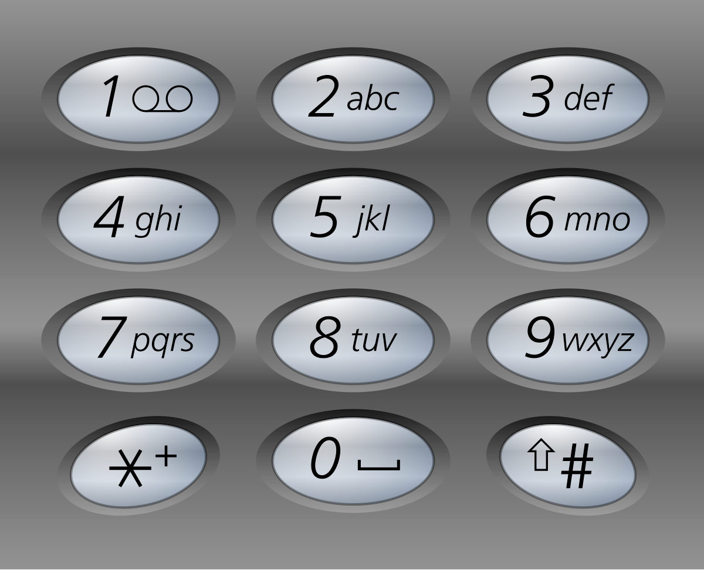

# Problem
https://leetcode.com/problems/letter-combinations-of-a-phone-number/description/

Given a string containing digits from 2-9 inclusive, return all possible letter combinations that the number could represent. Return the answer in **any order**.

A mapping of digits to letters (just like on the telephone buttons) is given below. Note that 1 does not map to any letters.

### Example 1:

    Input: digits = "23"
    Output: ["ad","ae","af","bd","be","bf","cd","ce","cf"]

### Example 2:

    Input: digits = "2"
    Output: ["a","b","c"]

### Constraints:

    1 <= digits.length <= 4
    digits[i] is a digit in the range ['2', '9'].

# Solution
## Intuition
- The problem is asking for combinations so this seems to be a backtracking problem
- The length of `digits` is not constant, so using loops to form combinations is not optimal. A recursive approach is easier.
- 

## Variables
- `ln`: hash table that maps digits to their letters
- `res`: list of all the possible combinations. This is the return value of the function
- `backtrack`: backtracking function
- `comb`: current combination of letters

## Algorithm in a nutshell
1. Take a digit
   2. Take a letter of a digit
   3. Append that letter to a temporary variable `comb`
   4. Call recursive function
   5. Repeat for all letters
6. Repeat for all digits

## Implementation
Looking at the algorithm one might think we need two loops to solve this problem. This is a naive mistake because the algorithm is recursive, so the recursion itself will take charge of one of the iterative aspects of the algorithm. Specifically, recursion will "iterate" over `digits`, while a loop will iterate over the letters of each digit. 

We use an `index` variable to iterate over `digits`. On each recursive call we'll add 1 to `index` to change the digit we're evaluating. Inside the function we then create a loop to iterate over all the letters of the current digit, appending each one to `comb`. 

Finally, when `index == len(digits)`(**base case**), we add `comb` to the list of combinations because only on this point we know we have formed a valid combination. Why? Because of the base case, i.e., we have processed all the digits of the input.