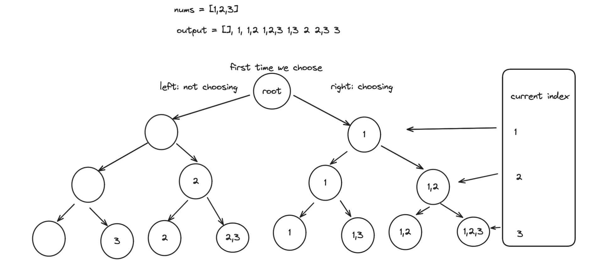

# Problem
https://leetcode.com/problems/subsets-ii/description/

Given an integer array `nums` that may contain duplicates, return _all possible_ subsets(selection of elements (possibly none) of the array, the power set).

The solution set **must not** contain duplicate subsets. Return the solution in **any order**.


### Example 1:

    Input: nums = [1,2,2]
    Output: [[],[1],[1,2],[1,2,2],[2],[2,2]]

### Example 2:

    Input: nums = [0]
    Output: [[],[0]]


### Constraints:

    1 <= nums.length <= 10
    -10 <= nums[i] <= 10

# Solution
## Variables
- `res`: list of all the subsets. This is the return value of the function
- `comb`: current subset.
- `i`: the index at which we’ll beging iterating over `nums`. We do this to avoid repeating elements in the subset.

## Intuition
If we look at example 1,

```
Input: nums = [1,2,2]
Output: [[],[1],[1,2],[1,2,2],[2],[2,2]]
```

we can illustrate this problem as building a decision tree on which we always have to decide between **two choices**:

1. Add the current element to the list of subsets
2. Don’t add the current element to the list of subsets

Why these choices? Simply because the problem states that we can’t have duplicate subsets. Subset `[1,2]` is the same as subset `[2,1]`, and having either one of those as part of the solution produces a valid solution.

The most straighforward way to build not repeated subsets is by first sorting `nums` as this will allow us to iterate over the array, in order, excluding previous elements from further considerations. For example, “since we know there is no more number 5s in the array further ahead as the array is sorted, we know we have already built all subsets with number 5, so we can confidently ignore number 5 in further iterations/recursive calls”. Sorting also facilitates detecting repeated elements, such as number 2 in example 1, and skip them to avoid forming repeated subsets.

Going back to the decision tree, adding the element will lead to a recursive path in which all subsets will contain said element. Not adding the element will lead to a recursive path in which none of the subsets will contain the element. If we follow this chain of thought we note that applying this decision to each element will lead to a situation in which we’ll have all the subsets we want.

If we draw all the decisions taken for each element we end up with a tree like the following:

Note that all the subsets are the ones on the last level of tree, i.e., when we can no longer continue iterating over `nums`. It is obvious that is the **base case**, the point at which we add the subset to `res` and also return from the recursive function.

## Algorithm

1. **Sort nums**. This will make the process of detecting repeated elements a lot easier, as they will be right next to each other.
2. **Backtracking function**. Takes `i`, the current index of `nums` we’re looking at, and `subset`, the current subset being formed.
    1. **Base case**. When we reach the last element of `nums` we can’t keep appending, so we return there.
    2. Add the current element to the current subset. This will repeat continuously over recursive calls until we reach the end of `nums`. This will make the larger sets to be built first [1,2,2], then [1,2], etc. This is doesn’t have to be like this btw. It’s jus the way this particular algorithm works.
    3. After `backtrack` returns we pop the last added element to the subset so we can go through the other part of the decision tree: forming the subsets that **don’t have** the current element
    4. But first we use a while loop to make sure that the next element is not the same as the current one to avoid forming duplicate subsets