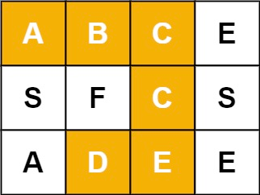
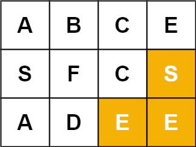
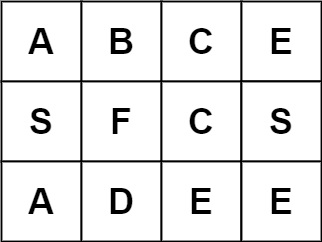
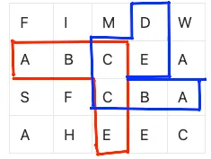

# Problem
https://leetcode.com/problems/word-search

Given an `m x n` grid of characters `board` and a string `word`, return `true` if word exists in the grid.

The word can be constructed from letters of sequentially adjacent cells, where adjacent cells are horizontally or vertically neighboring. The same letter cell may not be used more than once.

### Example 1:

    Input: board = [["A","B","C","E"],["S","F","C","S"],["A","D","E","E"]], word = "ABCCED"
    Output: true

### Example 2:

    
    Input: board = [["A","B","C","E"],["S","F","C","S"],["A","D","E","E"]], word = "SEE"
    Output: true

### Example 3:

    
    Input: board = [["A","B","C","E"],["S","F","C","S"],["A","D","E","E"]], word = "ABCB"
    Output: false

### Constraints:

    m == board.length
    n = board[i].length
    1 <= m, n <= 6
    1 <= word.length <= 15
    board and word consists of only lowercase and uppercase English letters.

# Solution
### Variables

- `visited`: contains the elements of the board we have already visited. We use this array to avoid forming a word with repeated cells. As we’ll see, recursive calls may visit elements from past iterations so keeping track of visited elements is important.
- `i`: row index of the board
- `j`: column index of the board.
- `index`: index of the current letter of `word` we’re currently evaluating.

### Algorithm

**In a nutshell**…. go through each letter in the board and try to form `word` going left, up, right or down from the letter.

1. Iterate over the whole board and call the recursive `backtrack` function.
    1. Note that the function is called only when an element of `board` equals the first letter of `word`. This is a way to make the function a little more efficient. There is no need to make recursive calls if we know for a fact that the word will not be formed.
2. Inside the backtrack function, check `if index == word.length`.
    1. This is the base case. Why? This condition will only be true when we have reached a point in the board where adjacent characters will have formed `word`. This is due to the constraints we imposed to the algorithm that won’t allow the execution from reaching this point unless a chain of adjacent characters form `word`.
3. Check the following conditions:
    1. both indeces are within the constraints of the board
    2. the current cell letter is the same as the next letter of `word`.
    3. the current cell letter has not yet been visited

   If none of these conditions pass we return `false` for obvious reasons.

4. If the current letter cell matches the next letter of `word`, we mark the cell as visited.
5. We make four recursive calls of `backtrack`, one for each direction, because we don’t know before hand the direction in which `word` will be formed, so we try them all.
6. If none of those recursive calls returns true then it means that even though the current letter matches the one we’re currently looking for, it’s position in the board won’t allow to form `word` with the constraints set by the problem, which is a possibility. Therefore we mark the cell as **not visited** because this cell letter led nowhere and this will allow us to use it again.
    1. **If “this cell letter led nowhere”, why do we mark it as “not visited” to consider it again in the future? Don’t we already know this cell doesn’t produce a valid `word`?** Not actually. The letter cell may not have produced a valid `word` due to the “path” and positions of the letters that precede it. For example, let’s say we have the board of the image and we’re looking for word “`ABCCED`”. The red path is made before the blue one. Note that there is no way for the red path to form `word` completely, but the blue one can. Both paths share two “C” cells. If we had left those cells as visited while doing the red path, the blue path wouldn’t have been able to form `word`.

       