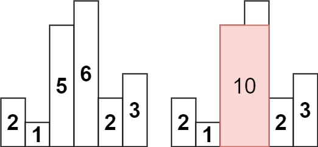
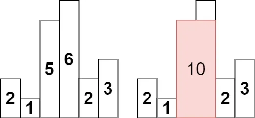
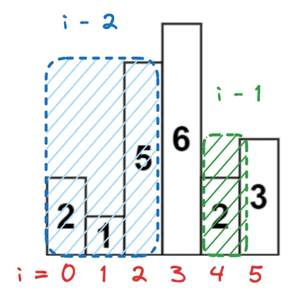
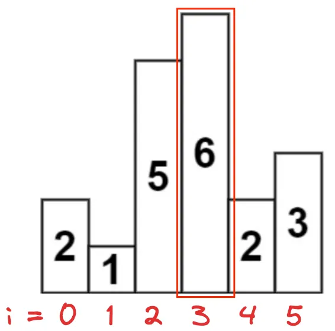
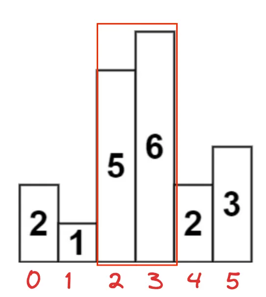

# Problem
https://leetcode.com/problems/largest-rectangle-in-histogram/description/

Given an array of integers heights representing the histogram's bar height where the width of each bar is 1, return the area of the largest rectangle in the histogram.


### Example 1:



    Input: heights = [2,1,5,6,2,3]
    Output: 10
    Explanation: The above is a histogram where width of each bar is 1.
    The largest rectangle is shown in the red area, which has an area = 10 units.

### Example 2:

    Input: heights = [2,4]
    Output: 4


### Constraints:

    1 <= heights.length <= 105
    0 <= heights[i] <= 104

# Solution




**The main idea** of this algorithm relies on the fact that since we want to find the largest area in the histogram, we have to maximize both the width(the amount of rectangles with which we’ll form the largest rectangle) and the height(choosing the tallest rectangles). 

### Key points

- Every time we find a larger height, we push to the stack because that means we can expand the area of the current rectangle being formed.
- When we find a smaller rectangle than the top of the stack, we calculate the area of all the rectangles up to `i`(exclusive)

### Algorithm

1. To maximize the height we iterate throught `heights` and add the indeces of the rectangles to a stack. Once we find a smaller rectangle than the top of the stack(which is the previous rectangle) we do a couple of things. 
    1. First, we stop because the height can no longer be maximized. We don’t know if adding this smaller rectangle to the calculation will considerably reduce the area we need. 
    2. Second, we use a while loop to calculate the area of all the rectangles included in the current range with the values we have. We do that by continously expanding the rectangles included in the calculation, traveling backwards. We start with the area of largest rectangle(top of the stack) and then continue adding other rectangles to the area calculation. 
        1. As `height` we use the top of the stack, which will be the largest rectangle found so far. We pop the top inmediately so it doesn’t affect the width calculation. 
        2. As `width`, we use `i - stack.Peek() - 1`. Mathematically what this subtraction is saying is "I only need the width of what remains **after** we exclude everything beyond the next height(stack.peek, this will be calculated on the next iteration) and the current index `i`(remember that`i` is not included in the calculation because it's height is lower). This is a complicated portion to understand so let’s illustrate it with an example. Let’s say that `i=4`, which is the number 2 after the 6.
            
            ```go
            Given that...
            stack.Peek = 2(index of 5) because we already popped 6
            
            Then...
            i - stack.Peek - 1 =
            4 - 2 - 1 = 1 
            
            This means that we only want to calculate the area of rectangle 6 which has a 
            width of 1.
            ```
            
            Here we have the subtraction illustrated, splitted in two. We first exclude everything before stack.Top, then exclude the 4th index(`i`).
            
            
            
            _Subtraction illustrated_
            
            
            
            _This is what we want_
            
            On the next iteration inside the while loop…
            
            ```go
            Given that...
            stack.Peek = 1(index of 1) because we already popped 5 when getting the height
            
            Then...
            i - stack.Peek - 1 =
            4 - 1 - 1 = 2
            
            The rectangle area has expanded, this means that now we want to calculate the area of rectangles 5 and 6. 
            ```
            
            
            
            We continuosly do this process of expanding the rectangles included in the calculation while the current height(`i`) is larger than the top of the stack.
            
        3. **Why do this “expanding rectangles thing” instead of just adding all the previous rectangles at once?** More rectangles doesn’t always mean largest area. Remember than we include smaller rectangles to the calculation, the area might get smaller. 
2. After we are done iterating throught `heights`, if the still stack has some elements. We do the same process again because the largest area might be among the last rectangles.