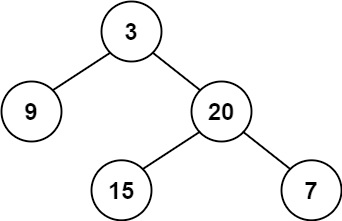
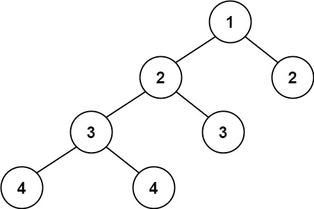

# Problem
https://leetcode.com/problems/balanced-binary-tree/

Given a binary tree, determine if it is **height-balanced**(binary tree in which the depth of the two subtrees of every node never differs by more than one).

### Example 1:

    Input: root = [3,9,20,null,null,15,7]
    Output: true

### Example 2:

    
    Input: root = [1,2,2,3,3,null,null,4,4]
    Output: false

### Example 3:

    Input: root = []
    Output: true

### Constraints:

    The number of nodes in the tree is in the range [0, 5000].
    -10^4 <= Node.val <= 10^4

# Solution
Recursively get the depth of every left and right subtree. When the depth difference between two subtrees is bigger than one, return false. If that never happens, then the tree is balanced. 