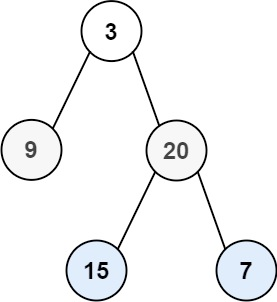

# Problem
https://leetcode.com/problems/binary-tree-level-order-traversal/description/

Given the `root` of a binary tree, return the level order traversal of its nodes' values. (i.e., from left to right, level by level).

### Example 1:

    Input: root = [3,9,20,null,null,15,7]
    Output: [[3],[9,20],[15,7]]

### Example 2:

    Input: root = [1]
    Output: [[1]]

### Example 3:
    
    Input: root = []
    Output: []

### Constraints:

    The number of nodes in the tree is in the range [0, 2000].
    -1000 <= Node.val <= 1000

# Solution
The iterative approach uses two additional data structures:

- `queue: Queue`: a queue to maintain the correct ordering of child nodes
- `nodesPerLvl: []int`: an array that contains the values of the nodes. We’ll call this, the “level array”

The algorithm begins by enqueuing the root node. While the queue is not empty, it captures the current size of the queue—this number represents exactly how many nodes are on the current level.

For each of those nodes, it dequeues the node at the front, adds its data to a level-specific array, and then enqueues its left and right children. This key behavior is what ensures that nodes are processed strictly on a level-by-level basis.

After that initial batch of nodes is processed, we add the level array to our final result list. Because we enqueued the children along the way, all the nodes for the *next* level are already waiting in the queue, perfectly lined up. We repeat this entire process until the queue is empty, meaning no unprocessed nodes remain.