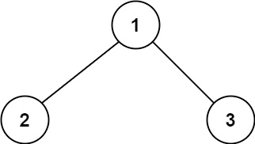
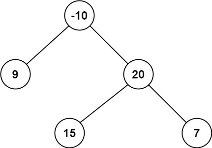
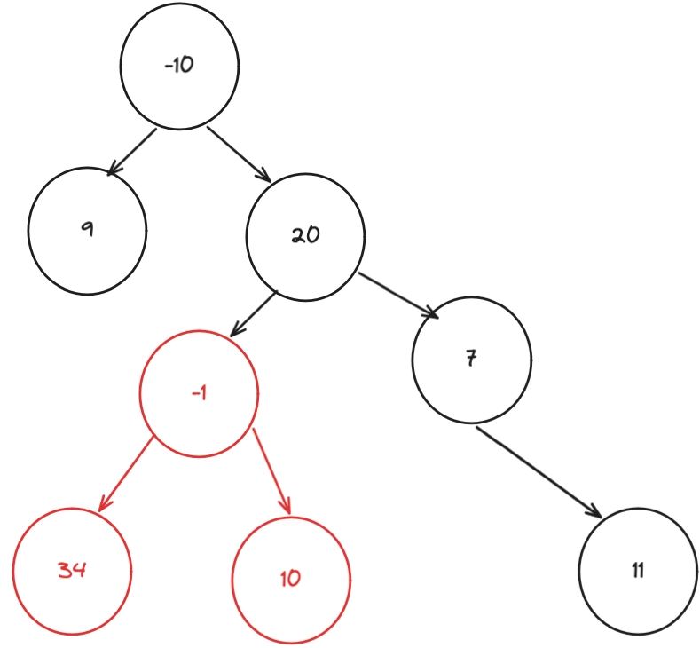

# Problem
https://leetcode.com/problems/binary-tree-maximum-path-sum/description/

A path in a binary tree is a sequence of nodes where each pair of adjacent nodes in the sequence has an edge connecting them. A node can only appear in the sequence at most once. Note that the path does not need to pass through the root.

The path sum of a path is the sum of the node's values in the path.

Given the root of a binary tree, return the maximum path sum of any non-empty path.

### Example 1:

    Input: root = [1,2,3]
    Output: 6
    Explanation: The optimal path is 2 -> 1 -> 3 with a path sum of 2 + 1 + 3 = 6.

### Example 2:

    Input: root = [-10,9,20,null,null,15,7]
    Output: 42
    Explanation: The optimal path is 15 -> 20 -> 7 with a path sum of 15 + 20 + 7 = 42.

### Constraints:

    The number of nodes in the tree is in the range [1, 3 * 10^4].
    -1000 <= Node.val <= 1000

# Solution
First of all we should note that there is only one opportunity to split into both left and right subtrees. The reason is that if a path splits into both left and right subtrees more than once, the same node would appear twice, which is not allowed.

Since we need to compare different starting points for the maximum path sum, we must consider both cases:

- When a node acts as a split point, including both left and right subtrees.
- When the path continues only through the left or right subtree. It cannot split at different levels because then nodes would repeat.

### Algorithm

1. So we create a recursive function that takes a node and will calculate the max sums of every valid path. We first update our result value `res` by getting the max between itself and the max sum of its right and left subtrees. This covers the case where the node acts as the split point.
2. We then return the max sum between its left and right subtrees, plus the nodes value. This covers the case where we choose either the left **or** right path(whichever has the largest sum). It’s the most important part of the algorithm. We need to return **ONLY ONE** of the paths(left or right) to the parent node to avoid repeating nodes in the sum. To understand this let’s look at an example:

   Let’s say we’re evaluating node 20 and we’re currently in the part that does `leftSum := max(0, dfs(node.Left))`(marked in red), which would make -1 be the current node. If on that recursive call we return `leftSum+rightSum+node.Val`(the sum of both -1’s left and right subtrees) we would effectively be creating two sum paths:

    1. 20-1+34 = 53
    2. 20-1+10 = 29

   The sum of 20’s left subtree would be 82, which is wrong because that sum includes the -1 two times and this is not valid. So this is why we do `max(leftSum, rightSum) + node.Val`, to choose only a single path out of the two, selecting the path with the largest sum, which is what we’re trying to maximize.

   

### Note

- We do `max(0, dfs(node.Left and node.Right))` to ignore negative values. If a subtree's maximum path yields a negative sum, including it would only decrease our total path sum.