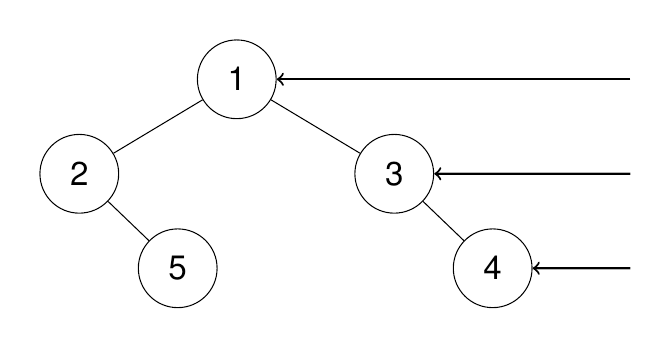
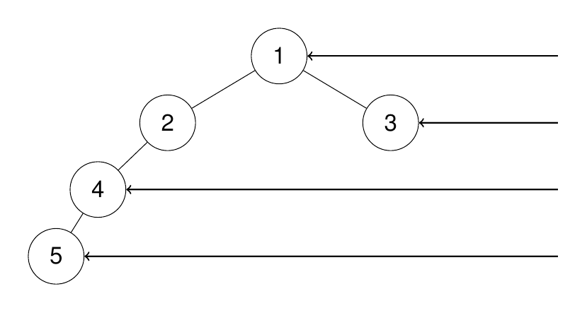

# Problem
https://leetcode.com/problems/binary-tree-right-side-view/description/

Given the root of a binary tree, imagine yourself standing on the right side of it, return the values of the nodes you can see ordered from top to bottom.

### Example 1:

    Input: root = [1,2,3,null,5,null,4]
    
    Output: [1,3,4]

Explanation:

### Example 2:

    Input: root = [1,2,3,4,null,null,null,5]
    
    Output: [1,3,4,5]

Explanation:

### Example 3:

    Input: root = [1,null,3]
    
    Output: [1,3]

### Example 4:

    Input: root = []
    
    Output: []

### Constraints:

    The number of nodes in the tree is in the range [0, 100].
    -100 <= Node.val <= 100

# Solution
**TL;DR** - Perform level order traversal of the tree using a queue, identify the last node to be added to a level and add it to the results list.

**Level order traversal** using a queue is done in the following way.

1. Add the `root` to a queue
2. While the queue has elements do this:
    1. Create an array of the size of the queue called `nodesByLvl`, which will hold all the nodes of a specific level
    2. Iterate over `nodesByLvl`, which even though it will be empty on the first iteration, we’d still be able to loop over it because the array has pre-allocated slots(queue size)
        1. Dequeue a node from the queue, and add it to the `nodesByLvl` array
        2. Enqueue the left and right childs of that node, in that order. When this loop is ran again it will iterate over all the child nodes of the nodes in the *current level*.
    3. Add `nodesByLvl` to the results list.

---

Note that the problem is basically asking us to do level order traversal but only including the right-most node of each level to the result list. So we can do just that, perform regular level order traversal but only including the “last” node of a level to the list.

1. First of all, the results list is of type `[]int`, not `[][]int`
2. There is no need for adding the nodes of a level to an array, because we only care about the last node of the level(`i == nodesPerLvl-1`). Hence, instead of building an array of nodes per level, we only use a variable to denote the length of that supposed array: `nodesPerLvl`.
3. When we reach the end of all the nodes in a level, we add that last node to the results list.