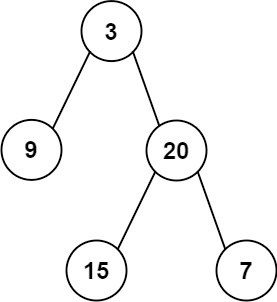

# Problem
https://leetcode.com/problems/construct-binary-tree-from-preorder-and-inorder-traversal/description/

Given two integer arrays preorder and inorder where preorder is the preorder traversal of a binary tree and inorder is the inorder traversal of the same tree, construct and return the binary tree.

### Example 1:

    Input: preorder = [3,9,20,15,7], inorder = [9,3,15,20,7]
    Output: [3,9,20,null,null,15,7]

### Example 2:

    Input: preorder = [-1], inorder = [-1]
    Output: [-1]

### Constraints:

- `1 <= preorder.length <= 3000`
- `inorder.length == preorder.length`
- `-3000 <= preorder[i], inorder[i] <= 3000`
- preorder and inorder consist of unique values.
- Each value of inorder also appears in preorder.
- preorder is **guaranteed** to be the preorder traversal of the tree.
- inorder is **guaranteed** to be the inorder traversal of the tree.

# Solution
The solution is based around two axioms:

1. The elements of `preorder` are ordered in a “root-first” manner
2. All the elements to before of a node `x` in `inorder` are in the left subtree of `x`; all the elements after `x` in `inorder` are the right subtree of `x`.

So we use `preorder` to build our roots iteratively and use the position of our roots in `inorder` to know what are the elements before and after each root, i.e., the left and right subtrees.

1. We first build a map `inorderPos` with the positions of each node on `inorder`. This will allows to quickly access the indexes in $O(1)$ time.
2. The recursive functions uses three pointers:
    1. `mid`: the position of the current root in `inorder`
    2. `start`: Servers as a range delimiter. All the elements between `start` and `mid - 1` are the ones in the left subtree of the current root.
    3. `end`: Servers as a range delimiter. All the elements between `mid + 1` and `end` are the ones in the right subtree of the current root.
3. Inside the recusive function…
    1. **Base case**: when start > end, then there are no more elements to process so we return.
    2. We use a `head` pointer to get the first element of `preorder`. The pointer should increase after every access so we can always get the first element out of `preorder` in $O(1)$ time. We do this to avoid re-processing of nodes in an efficient manner. After we set the children of a root of `preorder`, we don’t need to access that element again, so we “remove it” by treating the `preorder` array as a queue.
    3. Get the position of the current root on `inorder` by searching it in the `inorderPos` map.
    4. Build the left subtree of the current root by calling the recursive function limiting only to all the elements **before** the current root on `inorder`
    5. Build the right subtree of the current root by calling the recursive function limiting only to all the elements **after** the current root on `inorder`