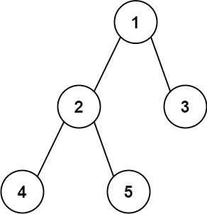

# Problem
https://leetcode.com/problems/diameter-of-binary-tree/description/

Given the root of a binary tree, return the length of the diameter of the tree.

The **diameter** of a binary tree is the length of the longest path between any two nodes in a tree. This path may or may not pass through the root.

The **length** of a path between two nodes is represented by the number of edges between them.

### Example 1:

    Input: root = [1,2,3,4,5]
    Output: 3
    Explanation: 3 is the length of the path [4,2,1,3] or [5,2,1,3].

### Example 2:

Input: root = [1,2]
Output: 1

### Constraints:

    The number of nodes in the tree is in the range [1, 10^4].
    -100 <= Node.val <= 100

# Solution
> **TL;DR** Recursively get the max distance between any two nodes in the tree for both the left and right subtree.

### Variables

- `max`: function that gets the maximum value between two numbers
- `getMaxDistance`: recursive function used to get the max distance between two nodes in a subtree
    - `node`: the node we’re evaluating in the *current* recursive call
    - `left`: the max distance between two nodes in the left subtree of `node`
    - `right`: the max distance between two nodes in the right subtree of `node`
- `res`: the current max length found so far. The return value of the function.

### Implementation

The solution builds up the diameter step-by-step, by combining the diameter of the left and right subtrees of every node and only getting the maximum of every one of them. To understand this code is helpful to visualize it so we’ll use the following tree to explain it:

This is a DFS algorithm. So the first time the `res` variable is updated is when we reach the left most node of the tree: 4.

1. **Node 4**. Since 4 doesn’t have left or right children both `left` and `right` will be zero, so will `res`. The recursive function returns 1 and we go back to node 2
2. **Node 2**. Make the recursive call to the right child, 5 and the same thing that happened with node 4 happens with this one: `left` and `right` will be zero, so will `res`. Return 1
3. **Node 2**. Both `left` and `right` are 1, so `res` is now 2 and we return 2. The max length between two nodes for the subtree with root node 2, is 2.
4. **Node 1**. `left`(node 2) is 2 and `right`(subtree with node 3) is 1(it has no children so the calculation is straightforward). This means that `res` is now 3. Since 1 is the root node, we return 3 as the result of the function.