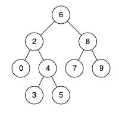

# Problem
https://leetcode.com/problems/lowest-common-ancestor-of-a-binary-search-tree/description/

Given a binary search tree (BST), find the lowest common ancestor (LCA) node of two given nodes in the BST.

According to the definition of LCA on Wikipedia: “The lowest common ancestor is defined between two nodes p and q as the lowest node in T that has both p and q as descendants (where we allow a node to be a descendant of itself).”

### Example 1:

    Input: root = [6,2,8,0,4,7,9,null,null,3,5], p = 2, q = 8
    Output: 6
    Explanation: The LCA of nodes 2 and 8 is 6.

### Example 2:

    Input: root = [6,2,8,0,4,7,9,null,null,3,5], p = 2, q = 4
    Output: 2
    Explanation: The LCA of nodes 2 and 4 is 2, since a node can be a descendant of itself according to the LCA definition.

### Example 3:

    Input: root = [2,1], p = 2, q = 1
    Output: 2

### Constraints:

    The number of nodes in the tree is in the range [2, 105].
    -10^9 <= Node.val <= 10^9
    All Node.val are unique.
    p != q
    p and q will exist in the BST.

# Solution
The solution is simple and it stems from several obvious facts:

1. If both nodes are greater than `root`, then `root` is not the LCA but rather a node in root’s right subtree. Hence, we can focus on root’s right subtree and forget about everything else.
2. If both nodes are smaller than `root`, then `root` is not the LCA but rather a node in root’s left subtree. Hence, we can focus on root’s left subtree and forget about everything else.
3. When neither of those conditions is satisfied we have found our LCA. Why? Because the **else** in this case can mean one of the following things:
    1. `p < root < q`: there is no need to keep going deeper in a subtree of root because `p` and `q` have diverged. From this point one they will always have **different** parents, since we’re looking for a **common** ancestor, we need to stop here.
    2. `p > root > q`: there is no need to keep going deeper in a subtree of root because `p` and `q` have diverged. From this point one they will always have **different** parents, since we’re looking for a **common** ancestor, we need to stop here.

