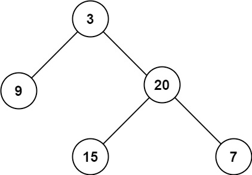

# Problem
https://leetcode.com/problems/maximum-depth-of-binary-tree/description/

Given the `root` of a binary tree, return its maximum depth.

A binary tree's maximum depth is the number of nodes along the longest path from the root node down to the farthest leaf node.


### Example 1:


    Input: root = [3,9,20,null,null,15,7]
    Output: 3

### Example 2:

    Input: root = [1,null,2]
    Output: 2


### Constraints:

    The number of nodes in the tree is in the range [0, 104].
    -100 <= Node.val <= 100

# Solution
Go as deep as possible in every branch of the tree using recursion. Keep track of the level you’re currently at by passing a `level` parameter to each recursive invocation. Upon reaching a leaf node, if the current `level` is higher than the current `max` level found so far, update `max`. Return `max` at the end.

Note that we really update the `max` value, not *exactly* upon reaching a leaf node, but **after** we try to access the “child” of a leaf node. We only know that a node is a “leaf” when we see that it has no children. Meaning, when we reach the base case of `node == nil` what this indicates us is that the *parent* of this node is the leaf node, not this one because `node` doesn’t exists(is nil after all). So, since we’re standing on a non-existing node we are also standing on a non-existing `level`, hence, we must subtract 1 from `level` before updating `max`…

```go
//...
if node == nil {
    return getMax(level-1, max)
}
//...

```