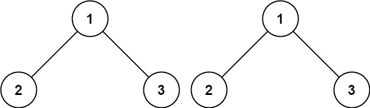
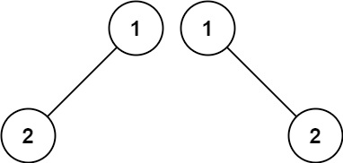
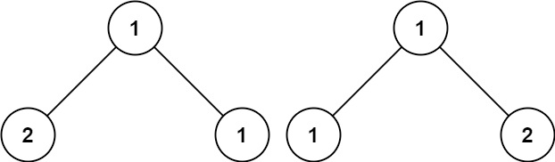
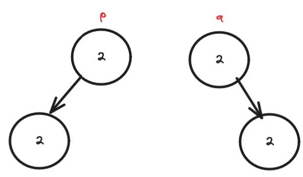

# Problem
https://leetcode.com/problems/same-tree/

Given the roots of two binary trees p and q, write a function to check if they are the same or not.

Two binary trees are considered the same if they are structurally identical, and the nodes have the same value.

Example 1:

    Input: p = [1,2,3], q = [1,2,3]
    Output: true

Example 2:

    Input: p = [1,2], q = [1,null,2]
    Output: false

Example 3:

    Input: p = [1,2,1], q = [1,1,2]
    Output: false

Constraints:

    The number of nodes in both trees is in the range [0, 100].
    -10^4 <= Node.val <= 10^4

# Solution
The solution parts from the fact that if both trees are the same, then they will both have the same pre or post order traversal path. 

I decided to add a nil/flag value that indicates the absence of a real node value, i.e., a non-existent node. This `nilValue` is -10,001 because the minimum value a node can have according to the problem description is -10,000, so we can rest assured that the appearance of -10001 indicates a nil node and not a node with said value.

## Why not use inorder?
Because of the particular manner I choose to signal a nil node, an in-order traversal will produce the same path array even for trees like the following ones:

Note that both trees have the same values, the same amount of nodes, but aren't structurally equal. However, the in-order traversal paths are the same:

    for the tree `p` the in-order path is: [null,2,null,2,null]
    for the tree `q` the in-order path is: [null,2,null,2,null]

Therefore, we have no way of knowing whether the trees are actually the same or not. With pre or post-order traversals, this problem doesn't occur. 