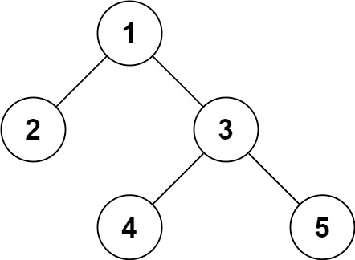

# Problem
https://leetcode.com/problems/serialize-and-deserialize-binary-tree/description/

Serialization is the process of converting a data structure or object into a sequence of bits so that it can be stored in a file or memory buffer, or transmitted across a network connection link to be reconstructed later in the same or another computer environment.

Design an algorithm to serialize and deserialize a binary tree. There is no restriction on how your serialization/deserialization algorithm should work. You just need to ensure that a binary tree can be serialized to a string and this string can be deserialized to the original tree structure.

**Clarification**: The input/output format is the same as [how LeetCode serializes a binary tree](https://support.leetcode.com/hc/en-us/articles/32442719377939-How-to-create-test-cases-on-LeetCode#h_01J5EGREAW3NAEJ14XC07GRW1A). You do not necessarily need to follow this format, so please be creative and come up with different approaches yourself.

### Example 1:

    Input: root = [1,2,3,null,null,4,5]
    Output: [1,2,3,null,null,4,5]

### Example 2:
    
    Input: root = []
    Output: []

### Constraints:

    The number of nodes in the tree is in the range [0, 10^4].
    -1000 <= Node.val <= 1000

# Solution
### Prerequisites

To understand this solution you need to know how BFS tree traversal works using queues.

### Serialize

We build a string representing the BFS traversal of the tree, including nil children. This is important as it will allow us to know the nodes that don’t have any children or only have a single children during the deserialization phase. In this way, calling `serialize` with the tree from example 1 would produce an output string: “`1,2,3,nil,nil,4,5`”

### Deserialize

We transform the output string from `serialize` to an array, splitting by “,”. In the same way we used a queue to do BFS traversal in the `serialize` function, we use a queue to do BFS “building” in the `deserialize` function. It’s basically doing the opposite to what we did before.

We obviously ignore the strings of the input array that are “nil”, as they signalize(we established this on the `serialize` function) the non-existence of a child node.