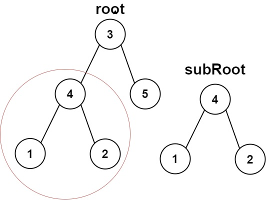
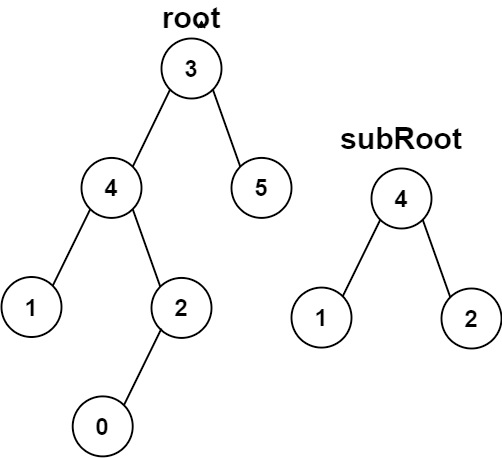

# Problem
https://leetcode.com/problems/subtree-of-another-tree/description/

Given the roots of two binary trees root and subRoot, return true if there is a subtree of root with the same structure and node values of subRoot and false otherwise.

A subtree of a binary tree tree is a tree that consists of a node in tree and all of this node's descendants. The tree tree could also be considered as a subtree of itself.

### Example 1:

    Input: root = [3,4,5,1,2], subRoot = [4,1,2]
    Output: true

### Example 2:

    Input: root = [3,4,5,1,2,null,null,null,null,0], subRoot = [4,1,2]
    Output: false

### Constraints:

    The number of nodes in the root tree is in the range [1, 2000].
    The number of nodes in the subRoot tree is in the range [1, 1000].
    -10^4 <= root.val <= 10^4
    -10^4 <= subRoot.val <= 10^4

# Solution
### Variables

- `isSame`: recursive function that compares whether two trees are equal or not. We’ll use this function to recursively compare subtrees of `root` with `subRoot`.
    - If `root == nil && subRoot == nil`, we return `true` because that **also** means both nodes are equal.
    - If either of them is nil while the other one isn’t we return `false` because that means they are not equal
    - Obviously, if the values of them aren’t the same, we also return `false`
    - In any other case, we recursively compare the left and right subtrees of both `root` and `subRoot` and return that.

### Implementation

The solution is composed of two recursive functions. These functions need to be separated for several reasons:

1. They’re doing different things. One is comparing two trees, while other is traversing `root`. In a nutshell:
    1. `isSubtree`**:** Its only job is to traverse `root`. At every single node, it asks "is this the start of a matching tree?"
    2. `isSame`**:** A dedicated helper function whose only job is to check if two trees are perfectly identical from their given roots downward.
2. Mixing up the logic of these functions in a single recursive function, **will produce bugs**. Mainly, is very hard to keep track of the current node of `subRoot` we’re evaluating when we note that a particular subtree of `root` is not equal to `subRoot`. In other words, backtracking to test another subtree gets very tricky.

In the main function `isSubtree` we traverse the `root` tree, recursively checking left and right subtrees until we get a match.