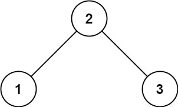
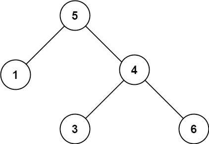

# Problem
https://leetcode.com/problems/validate-binary-search-tree/description/

Given the root of a binary tree, determine if it is a valid binary search tree (BST).

A **valid BST** is defined as follows:

- The left of subtree a node contains only nodes with keys strictly less than the node's key.
- The right subtree of a node contains only nodes with keys strictly greater than the node's key.
- Both the left and right subtrees must also be binary search trees.

### Example 1:

    Input: root = [2,1,3]
    Output: true

### Example 2:

    Input: root = [5,1,4,null,null,3,6]
    Output: false
    Explanation: The root node's value is 5 but its right child's value is 4.

### Constraints:

    The number of nodes in the tree is in the range [1, 10^4].
    -2^31 <= Node.val <= 2^31 - 1

# Solution
A valid BST will produce a sorted array of its elements in increasing order if we perform in-order traversal on it. So we’ll use that fact to identify whether the tree is BST.

Do in-order traversal of the tree, adding the nodes’ values to an array as you recurse. At the moment a node value is less than or equal to the last element in the array, we can return early indicating the BST is **not valid**. There is no need to keep going further down the tree.