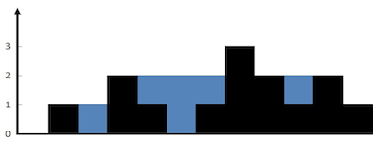
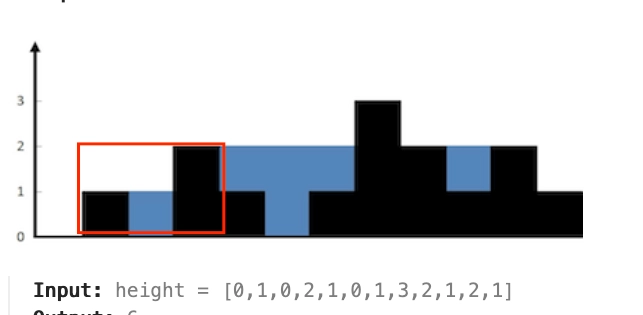
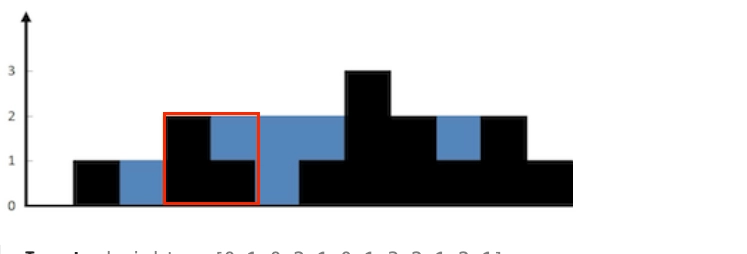

# Problem
https://leetcode.com/problems/trapping-rain-water/description/

Given n non-negative integers representing an elevation map where the width of each bar is 1, compute how much water it can trap after raining.


### Example 1:



    Input: height = [0,1,0,2,1,0,1,3,2,1,2,1]
    Output: 6
    Explanation: The above elevation map (black section) is represented by array [0,1,0,2,1,0,1,3,2,1,2,1]. In this case, 6 units of rain water (blue section) are being trapped.

### Example 2:

    Input: height = [4,2,0,3,2,5]
    Output: 9


### Constraints:

    n == height.length
    1 <= n <= 2 * 104
    0 <= height[i] <= 105

# Solution
### Intuition

The amount of water trapped above any specific block is determined entirely by the highest wall to its left, the highest wall to its right, and the height of the block itself. For example, we know that block at index 1 can hold 1 water because the heights of the walls to its left and right sides:



Water at any position depends on the **shorter** wall between the left and right sides. So if the left wall is shorter, the right wall can't help us—water is limited by the left side. That means we safely move the **left pointer** inward and calculate how much water can be trapped there. Similarly, if the right wall is shorter, we move the **right pointer** left.

As we move the pointers, we keep track of the highest wall seen so far on each side (`leftMax` and `rightMax`).

The water at each position is simply:

```go
max wall on that side – height at that position
```

### Algorithm

The solution works by adding up the water levels that can be hold up at each height. Clearly not all walls can hold water in top of them. The walls that can’t, wont be included in the total because when we reach them, the calculation we do for other walls will result in zero, but more on this later.

1. Set two pointers:
    - `l` at the start
    - `r` at the end
    - Track `leftMax` and `rightMax` as the tallest walls seen.
2. While `l < r`:
    - If `leftMax < rightMax`, this means that the amount of water we can hold here is limited by `leftMax` because if we pour more water than that, it will spill over. Hence, we calculate the water the `l++` water can hold.
        - Move `l` right.
        - Update `leftMax`.
        - Add `leftMax - height[l]` to the result.
        - **Why do we only consider left pointers in this calculation? Trapping water needs two walls and here we’re assuming that a right wall exists, is that valid?** Well, yes. The right wall assumption is correct because we already check it above in the `leftMax < rightMax` condition. If the left side we’re checking is smaller than the right side, it means water can be trapped there. We don’t care about the right side anymore in the calculation because of what we mentioned earlier: on this case the max water is limited by the *left wall*.
    - Else:
        - Move `r` left.
        - Update `rightMax`.
        - Add `rightMax - height[r]` to the result.
        - The logic explained before applies here, but for the right pointer: since right is smaller we are limited by this side and don’t care about left for the calculation.
3. Return the total trapped water.

---

**Why is the water calculated by subtracting `leftMax - height[l]` or `rightMax - height[r]`?**

Because we calculate the amount of trapped water one wall(index) at a time. The wall we’re calculating occupies a certain amount of volume. The difference of that volumen and the height of the max wall is the amount of empty space that’s left, space that can be occupied by water. See the example bellow. The index


